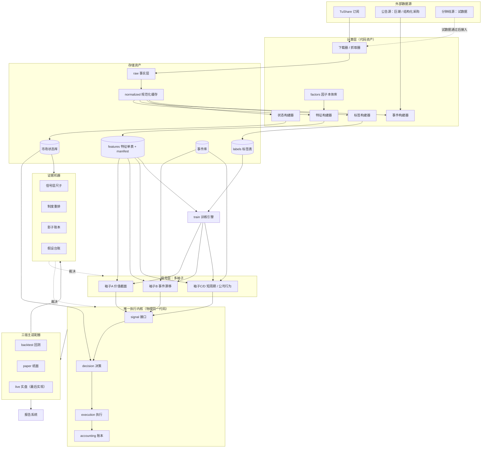

# LazyBull v2 架构重构方案（正式契约）

> **单文件制（F6 起生效，2026-10-01）**：原「plans/ 工作稿 + contracts/ 冻结版」双轨合并，本文件为**唯一载体**；
> 工作稿已退役，历史版本备份于 `docs/plans/v2/backup/`。修订流程：直接在本文件修订 → 头部版本表登记新行
> （状态=**草案**）→ 经评审后该行改「**生效**」并 commit（**git 历史只保留生效版本**，草稿不 commit）；
> 裁决引用「F 版本号 + commit」。生效状态：**P0 已于 2026-10-01 逐份确认通过（闸门关闭），现行生效版 = F8（2026-10-01，P1.5 裁决执行登记）**。
> 「冻结」语义澄清：本方案**持续演进**（F1→F6→F7→…，append-only 版本登记），"冻结版"指**裁决依据版本**而非不可变；
> 同日文件由 `v2_architecture_plan_frozen.md` 更名为 `v2_architecture_plan.md`（frozen 后缀在单文件制下名不副实；git mv 保留历史）。

| 冻结版本 | 落档日期 | 来源 | 状态 | 变更摘要 |
|---|---|---|---|---|
| F1（= v1.7b） | 2026-09-30 | plans/v2/v2_architecture_plan.md v1.7b | 生效 | 首次落档（经 R1+R2+R3 三轮评审 + 协议 R4/R5 回写） |
| F2（= v1.8） | 2026-10-01 | plans/v2/v2_architecture_plan.md v1.8 | 生效 | 对齐工作稿 v1.8：新增 §4.9 跨袖资金调度契约（软隔离+临时借用）+ M1.5 样本起点扩展（条件触发，P1 列级可用起点剖面前置诊断） |
| F3（= v1.9） | 2026-10-01 | plans/v2/v2_architecture_plan.md v1.9 | 生效 | P0 执行：§4.3 风控组件迁移清单核对补全（+stagger / sell_rules / 行业约束 / holdings_snapshot 四行） |
| F4（= v1.10） | 2026-10-01 | plans/v2/v2_architecture_plan.md v1.10 | 生效 | P0 评审第一轮：§5/§8.1 基线数字改引 baseline_freeze.md 冻结值；§4.9 归还规则优先级写死；§4.1 目录树补 data/ledger/ |
| F5（= v1.11） | 2026-10-01 | plans/v2/v2_architecture_plan.md v1.11 | 生效 | P0 评审第二轮：止损/止盈双层归属（1-A）；迁移清单「在用全域」可验证机制（1-B）；stagger anchor 来源单点化（1-C）；P1.5 判据主判据衔接注记（1-D） |
| F6（= v1.12） | 2026-10-01 | 本文件单文件制修订（原工作稿 v1.12） | 生效 | P5a-1 实现评审 R-09 程序修正：§3.5 合成臂构造规则改为「基线 + 噪声实现 + 等值平移」、检出概率升级为 M 个噪声实现检出频率、双指标判据（ΔCAGR + ΔMaxDD）；同日双轨合并为单文件制（工作稿退役，备份入 plans/v2/backup/） |
| F7（= v1.13） | 2026-10-01 | 本文件单文件制修订（§5 一次性修订窗口执行） | **生效**（两轮评审收口：首轮 A-1~B-3、第二轮 F7R-01~06 全量处置） | 修订窗口三项拍板（A1/B1/C1）：§5 主判据补功效适用域（ΔMaxDD 裁决域 = 回撤型改进；收益型走配对 ΔCAGR + §0.3 通道）+ 副判据噪声带改实测刻度；§3.5 MDE 层级表按密网格功效标定定稿（袖内净值 5pp→12pp = 80% 检出点 / 跨袖与组合层 5~8pp+→≥12pp / 标定网格 {2,5,8,10,12,15}pp）；§3.2 准入判据①自洽性平移档 2pp→12pp 与 MDE 对齐 + 补净值层受理门槛；依据产物 `p5a1_power_calibration_densegrid_20261001.json` + `p5a1_criterion_consistency_12pp_20261001.json`；台账决议条目 `H-v2-metrics-revision-window-20261001`；决策记录 `docs/review/v2_revision_window_f7_decision_20261001.md` |
| F8（= v1.14） | 2026-10-01 | 本文件单文件制修订（P1.5 裁决执行登记） | **生效**（两轮评审收口：F8R-01~11 + F8R-A1~C8 全量处置） | P1.5 政策层迁移前裁决执行：e2online_r **退役**（fallback 路径：§4.8 结构判据决定性 + R-007 定性 + 亏损日口径证据；配对 ΔCAGR 跨 0，登记「统计不可裁决」）；迁移目标 = **B0 neutral**；文本登记五处（§4.3 迁移清单行 / §5 迁移目标 / §9.1 λ 条款不启用 / §8-P1.5 行 / §8.1-M1 行）；裁决报告 `docs/reports/p15_policy_layer_adjudication_20261001.md`；台账 conclusion `H-P1.5-adjudication-conclusion-20261001`；生效时点 = v2 切换日（迁移期旧链路默认臂不变更） |

---
---
# LazyBull v2 架构重构方案（完整版）

> 版本：方案 v1.14（2026-10-01）
> 状态：**已生效**（F8 = P1.5 裁决执行登记——e2online_r 退役、迁移目标 B0；经两轮评审收口 F8R-01~11 / F8R-A1~C8）
> 范围：架构蓝图 + 全部契约草案 + 分期实施计划。本方案不含任何代码改动。
> v1.1 修订：袖子规格展开与运行形态、入场时机方案、数据血缘补全、每日运行 / 功能退役契约、重构质量保障、基线数字更新、路线图。
> v1.2 修订：架构图全节点闭环修正；袖子资金约束与设计解耦（50 万仅为示例规模）；新因子归属规则（factors 中心 + 边界示例）；路线图详细化（M1~M4 目标 / 出口 / 停止 / 成本）。
> v1.3 修订（外部评审吸收）：P5a 证据机器提前（与 P1 并行）；分级验收闸门 + 归因预算上限；净额化规则 P2 前冻结；制度重排功效标定；P1 闸门对齐母截面先例；滚动轨 M3 前只影子；执行保障四项。
> v1.4 修订（第二轮外部评审吸收）：《runs 产物契约》进 P0；metrics_v1 预留标定后一次性修订窗口；净额化冻结分"已验证语义 / 设计意图"两区；功效标定构造规则预登记；§4.2 与 §9.1 验收口径统一；P5a 拆分并写明真实并行编排；SLA 重启规则；爬坡建仓立项门挂 P5a 产物；并列互换频次计数；基线稳定条款按"无生产系统"澄清改写。
> v1.5 修订（第三轮外部评审吸收）：政策层迁移前裁决（基线双臂冻结 + P0.5）；新增《组件耦合度契约》（§4.8）；风控组件迁移清单表格化；对账门增 λ 序列规则。
> v1.6 修订（外部评审存档 R1+R2 吸收）：判据面整体补全（配对差分唯一裁决口径 / P1.5 多判据组合 / 准入判据形式化 + 自洽性标定 / 尺子按袖标定 + MDE 层级表）；数据面（panel 冷热分层 + 五契约补丁 / P1 冻结参照 + ensure 探测）；组合面（四件硬约束 / 删 β / 净额化分层语义 + 三恒等式 + P6.5）；编排（影子不对称规则 / 编码单元定义 / M1 总放弃判据 / 软生产澄清 / P-1 测算）。
> v1.7 修订（评审第三轮 7 条吸收）：成本护栏袖内口径；准入判据修订通道；β / 风险模型残留清理；P0 预算修正；登记不采纳清单；P-1 对照构造写死；P7.5→P6.5。
> v1.7a / v1.7b（协议层 R4/R5 回写）：§4.3 目录树加 common/protocols 与 common/rules；§4.1 台账写入走 DataStore；§3.4 每日执行边界声明；§3.2 lot 批次模型依据；§8 P0 加协议交付物；§4.3 依赖方向台账例外半句。
> v1.8 修订（用户补充两问）：新增《跨袖资金调度契约》（§4.9，软隔离+临时借用）；新增「样本起点扩展」前置诊断（§8 P1 加列级可用起点剖面；manifest available_from 支撑的「分时段变列集」作为有条件立项方向）。
> v1.9 修订（P0 执行）：§4.3 风控组件迁移清单核对补全——补入 stagger / sell_rules / 行业约束 / holdings_snapshot 四行（R2.4 指出的在用未列组件）；其余交付物落档至 docs/contracts/（runs 产物契约 / events-state schema / 假设台账 schema / 净额化冻结文档）。
> v1.10 修订（P0 外部评审第一轮）：A 类修复——§5/§8.1 基线数字改引 baseline_freeze.md 冻结值（消除与 0929 弃用批次引用的矛盾）；§4.9 归还规则优先级写死（放弃新下单优先、被动卖出默认禁止且无 OrderReason 枚举）；§4.1 目录树补 data/ledger/ 台账。
> v1.11 修订（P0 外部评审第二轮）：止损/止盈双层归属（纯函数→common/rules、调用编排→core/decision，对齐协议 §11）；迁移清单补「在用全域」可验证机制（两主链路 import 闭包对账）；stagger anchor 来源单点化（common/rules 定义来源枚举）；§8-P1.5 判据补主判据衔接注记（ΔMaxDD 不跨实现比较，沿 R-004 降级条款）。
> v1.12 修订（P5a-1 实现评审，R-09 程序修正）：§3.5 合成臂构造规则修订——原「折内日收益等值平移」被实测自证矛盾（等值平移 Δ 波动为 0，+1pp 检出 ≈100% vs 真实 +1.78pp 不可区分），改为「**基线 + 噪声实现（真实换种子逐日差重采样 / 块自举代理） + 等值平移**」；检出概率升级为 **M 个噪声实现的检出频率**（非单次布尔）；检出判据覆盖双指标（ΔCAGR + ΔMaxDD 北极星）。术语库「合成臂」「功效标定」同步修订。
> v1.13 修订（**§5 一次性修订窗口执行**，2026-10-01，拍板 A1/B1/C1）：P5a-1 功效标定与判据自洽性产出后，§5 预留的修订窗口执行一次并关闭——① §5 主判据补**功效适用域**明文：配对 ΔMaxDD 分布的裁决域 = **回撤型改进**（平移型改进 +15pp 下 ΔMaxDD 检出仅 25%——等值平移不改崩盘段主导的回撤结构，低检出是尺子的正确行为而非失效；真实回撤型改进可检出，B0/B1 实证区间下界 +0.28pp>0），收益型改进走配对 ΔCAGR 分布 + §0.3 通道分派；② §3.5 **MDE 层级表按密网格功效标定定稿**（真实换种子噪声下 ΔCAGR 检出：2pp→5% / 5pp→20% / 8pp→50%〔半功率点〕 / 10pp→75% / 12pp→85% / 15pp→100%）：袖内净值档 5pp→**12pp**（80% 检出点）、跨袖与组合层 5~8pp+→**≥12pp**，§5 副判据 ±5pp 噪声带声明同步实测化；③ §3.2 准入判据①自洽性平移档 2pp→**12pp**（2pp 档检出 5%/0% 永不可达；12pp 档 ΔCAGR 检出 85% 通过自洽；ΔMaxDD 维度对平移型功效不足属预期、仅用于回撤型裁决），并补净值层受理门槛（承诺效应 <MDE 的候选走信号层尺子 / 影子否决线 / 台账跨季通道）。依据产物：`data/reports/p5a1_power_calibration_densegrid_20261001.json`、`data/reports/p5a1_criterion_consistency_12pp_20261001.json`；台账决议条目 `H-v2-metrics-revision-window-20261001`。⚪ 口径登记（F7 评审 B-1）：12pp 档 ΔMaxDD 检出 densegrid 网格运行 20% vs consistency 单档运行 25%，差异来自 RNG 流消耗顺序（同种子同 M/n_boot），M=20 频率分辨率内一致，引用以 densegrid 为准。⚪ 待办登记：回撤型功效刻度缺口 → §8 P5b（§5 功效适用域段）；`run_power_calibration.py` 同日覆盖缺口 → §8 P5a-2。决策记录（含 A/B/C 备选集与落选理由）：`docs/review/v2_revision_window_f7_decision_20261001.md`。④ 评审收口（F7R-01）：§3.5 出厂曲线与 §8.1-M2 ⑥ 残留的「+1/+2/+5pp」改引定稿网格 {2,5,8,10,12,15}pp（消除与 MDE 定稿的自相矛盾）；F7R-02 复现命令勘误与分节产物口径见决策记录 §2/§6.2。
> v1.14 修订（**P1.5 裁决执行登记**，2026-10-01）：P1.5 政策层迁移前裁决执行完毕——e2online_r **退役**（fallback 路径：§4.8 结构判据决定性 + R-007 定性 + 亏损日口径新证据；配对 ΔCAGR 跨 0，登记「统计不可裁决」）；迁移目标 = **B0 neutral**。文本登记**五处**：§4.3 迁移清单政策层行（裁决中 → 退役）/ §5 迁移目标（= B0）/ §9.1 λ 序列验收条款（不启用）/ §8-P1.5 行（执行完毕）/ §8.1-M1 行。两轮评审（F8R-01~11 / F8R-A1~C8）收口追加：§3.3 条件结构两处注记；§4.3 尾注（terminal_loss 家族随 P3 评审 + 切换日物理删除时序衔接）；§5 裁决效力 / 对账旧侧 B0 口径 + 预期管理（v2 回撤特征向 B0 档靠拢 = 已知接受项）；§8-P3 行家族处置评审；§8-P1.5 行「差异台账」用词勘误（→ 假设台账与退役档案）；§9.1 归因第三级注记；§10 / §11 时态注记。裁决报告 `docs/reports/p15_policy_layer_adjudication_20261001.md`（含 §8 附录 +6.0pp 三分解归因，履行 baseline_freeze §5 预登记义务）；台账 conclusion `H-P1.5-adjudication-conclusion-20261001`；生效时点 = v2 切换日（迁移期旧链路默认臂不变更）。
> 载体说明：自 F6（2026-10-01）起本文件为方案唯一载体（单文件制，原双轨工作稿退役）；修订直接在本文件进行，经评审后在头部版本表登记，**生效才 commit**；历史工作稿版本备份见 `docs/plans/v2/backup/`。

---

## 0. 背景与诊断

### 0.1 为什么需要 v2：三个上限

| 上限 | 证据 | 性质 |
|---|---|---|
| L1 信号信息上限 | 四轮数据家族 A/B 全败（holdertrade / repurchase / top10fh / top_inst），"单列最好列"也一致为负 ⇒ 单模型"加列"入口已饱和 | 范式约束（可改） |
| L2 判定分辨率上限 | 同配置仅换种子：ΔCAGR ±3~5pp、ΔMaxDD ±0.6pp ⇒ 小于 ~5pp 的改进在现行 14 折净值判据下不可读出；独立崩盘事件仅 2~3 个 | 结构性（重写第一优先级） |
| L3 风险结构上限 | 市场级择时 0/21、扩域=崩盘放大器、个股退出被证否 ⇒ "单一多头组合 + 现金开关"内自由度接近零 | 硬约束（现货多头，不可改） |

### 0.2 v2 目标：拆掉三处单点化

1. **信息单点**：所有信息走"加列"进同一模型 → **多袖子**（一块独立管理、独立记账、独立验收的资金流）。
2. **决策单点**：固定 20 日日历全员同调 → **信号生命周期**（每个袖子按自身信号衰减速度决定持有期）。
3. **证据单点**：单条历史路径定生死 → **制度重排分布 + 前向影子账本 + 假设台账**。

外加三项工程统一：
- 回测 / 纸面 / 实盘**物理同一份代码**（唯一内核 + 三宿主适配器）；
- 三端**同一套数据**（单表特征资产，cs_train / cs_infer 概念取消）；
- **契约化防腐化**（数据存储、代码目录、代码复杂度、术语四件套）。

### 0.3 硬边界（先声明，防幻觉）

- 现货、只做多、非杠杆、不做衍生品 ⇒ 组合回撤底线 = β × 市场。v2 对回撤的贡献是"同 β 下更优 + 结构性避免放大器"，不是消灭 −20% 级回撤。
- 单市场单历史 ⇒ 一切结论带宽置信带；制度重排是缓解不是治愈。
- **不承诺收益跳变**：v2 的真实产出 = "**每季度吞吐一轮完整裁决周期**"的能力 + 新信息吞吐；1~2pp 级改进的裁决通道是**信号层尺子 + 假设台账跨季累积**（前向影子账本只承担止损级 ≥5pp 仲裁与工程形式确认——单市场单历史下，2pp 的纯前向统计检出需 11~15 年，通道错置必须明示）；**台账跨季累积的置信规则**：仅当"跨季同向且每季区间下界 >0"才允许累积，否则只登记不裁决（防止把历史内证据复用当复利计息器）；收益上限的真正抬升只能来自新信息渠道（袖子）。

### 0.4 本版已吸收的澄清

1. 实盘最后实现（暂无券商接口）；实盘手工操作形态（钉钉下发指令、人工挂单）。
2. 成交口径更正：全部交易按 **T+1 开盘价**成交（与现引擎一致）；跌停顺延与现状一致；买入遇涨停在实盘可人工切换下一候选（登记为实盘已知偏差）。
3. 报告只需桌面浏览器；树莓派维持现有实时收益显示；钉钉维持每日交易执行 / 持仓查看 / 次日操作获取。
4. 数据采购：除分钟线外均无异议；分钟线先免费试数据（AKShare / eFinance），有效即采购（TuShare 2000 元/年）。
5. 买入遇涨停两层口径（系统确定性顺延 + 实盘人工切换台账）。
6. 列族文件大小规则（逻辑列族 ≠ 物理单文件；256MB 软上限；禁止跨日合并持久化）。
7. `factors/` 目录保留（因子本体库）；manifest 成为列清单唯一来源；运行时派生退役。
8. 代码复杂度契约（文件 / 函数行数、圈复杂度、嵌套深度 + 豁免机制）。

### 0.5 v1.1 修订要点（2026-09-30）

1. 袖子规格展开（§3.2）：共 4 只 = 1 只迁移基准（A）+ 3 只新建（B/C/D），明确开发顺序；新增"袖子运行形态"（逻辑分账 / 物理合并 / 净额化 / 小资金门槛）。
2. 新增"入场时机（爬坡建仓）"设计方向与验证方案（§3.3）；"入场点敏感度报告"纳入证据机器标准产物（§3.5）。
3. 数据面血缘补全（§2 架构图 + §4.1）：事件库来源 = 公告源；状态库来源 = 规范化数据派生；factors = 代码资产。
4. 新增《每日运行契约》（§4.6）与《功能退役契约》（§4.7）。
5. 新增重构质量保障机制（§9.1）：旁路生长、行为冻结、三重门、冻结数据态、停止规则、差异台账。
6. 基线数字更新（§5）：以 2026-09-29 最新实测替换旧参考值。
7. 新增路线图（§8.1）：M2 证据与报告 → M3 新信息扩容 → M4 实盘闭环 → 远期。

### 0.6 v1.2 修订要点（2026-09-30）

1. 架构图修正（§2）：全节点闭环——分钟线源虚线接入下载器；事件库 → 袖子 B/D；状态库 → 决策 / 证据；labels 独立构建器 + 消费方（训练）；factors 归入"计算层（代码资产）"并注明无数据输入。
2. 袖子资金约束与设计解耦（§3.2、§8.1-M3.4）：单股最小金额 / 持仓上限 = 运行参数，不是设计上限；袖数按实验结果动态调配、资金可扩展（50 万仅为示例，500 万+ 线性扩容）。
3. 新因子归属规则（§4.3）：新因子一律进 `factors/`（按域建子包）；袖子目录只放规格与信号逻辑；给出依赖方向理由与边界示例。
4. 路线图详细化（§8.1）：M1~M4 + 远期，各含目标 / 出口判据 / 停止规则 / 成本估计与依赖顺序。

### 0.7 v1.3 修订要点（外部评审吸收，2026-09-30）

1. **证据机器提前（S1）**：只读三件套（尺子固化 / 制度重排 / 入场敏感度 / 假设台账）拆为 **P5a、与 P1 并行**（不依赖新内核，出口在旧系统上即可验收）；影子多臂改为 P5b（MVP 后，需新链路）。
2. **分级验收（S3）**：逐位一致 → 三层闸门（成交逐笔一致 / 净值 1e-6 容差 / **归因预算硬上限 3 编码单元**）；停止规则增加预算维度（§9.1）。
3. **净额化规则 P2 前冻结（S4）**：无开关的确定性算法成文；优先级 = 费用最小化 > 净额化 > 集中度约束 > 目标跟踪；参数化请求走预登记。
4. **功效标定（S5）**：制度重排出厂须产出"合成臂 +1 / +2 / +5pp → 检出概率"曲线；分布结论必须标注有效样本量（≈折数级）。
5. **P1 闸门对齐母截面先例（S6）**：实现漂移报错 / 数据态漂移告警 + 离群登记；出口 = 残差 100% 归因；回填预算含口径漂移处置。
6. **滚动轨限权（S7）**：M3 结项前线上滚动轨只跑影子、不参与任何裁决。
7. 执行保障：复杂度检查入 hook（P0 交付）；P4 标注日历下限（≥2 周）；术语库唯一 owner + 按引用热度排序；基线冻结含逐折收益路径文件。
8. 不纳入项：S2（袖子 B 首测提前）与方案 R（减配版）——按你的决定不进入本轮修订。

### 0.8 v1.4 修订要点（第二轮外部评审吸收，2026-09-30）

1. **《runs 产物契约》进 P0**：账本 / 逐日明细 / 报告的字段级 schema 冻结成文；证据机器只认该 schema，旧 WF 产物由一次性转换器对齐——防止 P5a 建在旧产物格式上、P2 切换后被"格式适配税"反噬；P5a-1 的"3 个历史实验重算一致"验收同时验收转换器。
2. **metrics_v1 预留一次性修订窗口**：主判据"MaxDD 制度重排 p90"的可检出性要待 P5a 功效标定曲线产出后才能验证 ⇒ P5a 标定完成后、P2 开工前，允许仅依据标定结果修订一次主判据口径（此时新系统尚无任何结论产生，修订零污染、零重判成本）。
3. **净额化冻结文档分两区**：**已验证语义**（单袖退化 = 净额化直通，P2 对账可验）与**设计意图**（多袖合并优先级，标注"P7 双袖并行时实测复核"）；P7 独立存活评审清单含"净额化规则实测复核"。
4. **功效标定构造规则预登记**：折内日收益等值平移（写死，禁止事后挑选构造方式）。
5. **口径统一**：§4.2 "MVP 验收逐位一致"改为以 §9.1 分级验收为准（成交逐笔一致 + 净值 1e-6 容差）。
6. **P5a 拆分**：P5a-1（制度重排 + 功效标定 + 尺子固化）/ P5a-2（假设台账 + 历史结论回填 + 入场敏感度）；"并行"的真实编排写明 = P1 回填跑机器的 3~8h 等待窗口内做 P5a-1 编码。
7. **SLA 重启规则**：非系统原因（数据源故障 / 停电）豁免但登记，系统原因清零重计。
8. **爬坡建仓立项门**：挂 P5a-2 入场敏感度实测宽度——现系统敏感度已足够窄则不立项；即使立项优先级排在所有袖子之后。
9. **并列互换频次计数**：P2 对账门中"并列分数互换"超过入选数 5% ⇒ 判定为信号层分数分辨率不足，登记而非默默归因。
10. **基线稳定条款改写**：按"项目当前无生产系统"澄清——迁移期不存在每日生产修复压力，旧链路执行**行为冻结**（崩溃级修复除外，且任何改变行为的修复触发对应段基线重冻结 + 差异台账回溯标注），从制度上消除"对账基线移动"风险源。

### 0.9 v1.5 修订要点（第三轮外部评审吸收，2026-09-30）

1. **政策层改为迁移前裁决（卸包袱，而非带包袱复刻）**：e2online_r 是"等价复刻"最难的组件（依赖 14 折 terminal_risk 模型目录 + 预热面板 + 在线现算 + 持仓路径反馈；且在线口径下 5/446 日 λ 翻转曾让 ΔMaxDD 差 1.2pp）。其净值贡献在严格口径下本就不可证（R-004 在线复核 ΔMaxDD −0.15pp 不达标，回撤改善仅在冻结表口径成立；09-20 转正依据为"方向偏正、量级不可承诺"的软理由）。⇒ 基线**双臂冻结**（B0 无政策 / B1 含政策），P5a-1 功效标定定稿主判据后，用制度重排分布裁决去留；**败者退役（§4.7 首次实战），迁移目标只含胜者**。顺序依赖写死：功效标定 → 主判据口径定稿（一次性修订窗口）→ 政策层裁决 → P2 迁移胜者。
2. **新增《组件耦合度契约》（§4.8）**：政策层难复刻的根因 = 模型→模型链式依赖（决策组件消费另一模型家族的在线推理输出）+ 路径反馈回路（λ 影响持仓、持仓又输入 λ 判定）。契约禁止这两类结构进默认链路；新组件立项必须通过"独立可验收性"检查（增量可用台账 / 影子独立归因，否则不允许进默认链路）。
3. **风控组件迁移清单表格化**（§4.3）：替代 `risk/* → core/decision` 一句笼统映射——e2online_r 标注"裁决中"、PositionRiskModel 迁移原样（母截面链路迁到 normalized、窗口口径冻结）、per_stock_exit 不迁移（R-005 已终止，退役档案）。
4. **对账门增 λ 序列规则（§9.1）**：若政策层裁决保留，P2 验收在成交逐笔 / 净值容差之外**单列一条**——"λ 序列逐日一致率 100%（差异日 100% 归因）"；该指标比净值容差更敏感，能在 P2 早期暴露政策层实现漂移。
5. **§3.3 条件结构表述改待裁决**："唯一幸存的条件结构升格为正式组件"改为"是否进 v2 由政策层裁决一并发决"。

### 0.10 v1.6 修订要点（评审存档 R1+R2 吸收，2026-09-30）

评审存档：`docs/review/v2_architecture_review_r1_r2.md`（R2.6 清单 A~D 全量吸收；两处精化见本条 9/10）。

1. **制度重排 = 配对差分为唯一裁决口径**（R1-1/R2.2）：两臂共用同一折排列集，比较 ΔMaxDD_k / ΔCAGR_k 的**分布**（P(Δ>0) + 最差排列 Δ），复用 `fold_subset.py::bootstrap_delta` 配对骨架；非配对 p90 降格附录展示；功效标定曲线在配对口径产出；一次性修订窗口候选口径显式列入"配对重排差分"。理由：14 块积木的非配对重排离散度只反映排列不确定性，且违反项目既有"成对比较必须共用同一日期块抽样"契约。
2. **P0.5 更名 P1.5 且判据改多判据组合**（R2.1）：政策层去留改用**配对 ΔCAGR 分布 + 亏损日频率与幅度（沿 E2 契约）+ 结构成本（§4.8 定性计分）** 三判据组合，裁决规则预登记；补 fallback（功效不足 ⇒ 降级为结构判据 + R-007 既有证据定性裁决，登记"统计不可裁决"）；**裁决生效时点 = v2 切换日**（不得在迁移期对旧链路执行退役，防基线移动）。修法动机：用 MaxDD 单判据裁决等于用"它从未承诺且已被实证不达标的维度"审判，结局预设为退役，不是裁决是走过场。
3. **袖子准入判据形式化 + 判据自洽性标定**（R1-3/R2.5-A4）：准入判据补数值形式与噪声带来源（§3.2）；P5a-1 标定范围扩展——**判据自洽性测试**（A vs A 换种子应判"不可区分"、A vs A+2pp 平移应判"可检出"，基准袖子过不了的判据不得用于裁决）；相关判据三口径（全样本 / 调仓频 / 崩盘段条件相关）+ 区间上界判定；假设台账加候选池分母与 α 预算（多重比较控制）。
4. **每袖尺子各自重标定 + metrics 适用域**（R2.5-A5）：±10bps 尺子是"同日同池同持有期（20 日）"标定的，跨袖沿用超出定义域；每袖按自身持有期重标定；metrics_v1 每指标标注适用域（袖内 / 跨袖 / 组合层 / 仅袖子 A）；MDE 层级表（列级 10bps / 袖内净值 5pp / 跨袖与组合层 5~8pp+）。
5. **panel 冷热分层**（R1-3 存储层/B1）：热区按日分区，封存后**按月压实**（≈2.1 万 → ~1,000 文件；实测拆列族读 5 列慢 5.1 倍）；256MB 上限 + 32MB 软下限；P1 加性能闸门（全历史跨列族加载 ≤ 现状 1.5 倍）。
6. **五个数据契约补丁进 P0**（R2.5-B2）：列族对齐契约（拼接键 (trade_date, ts_code) + core 左表 left join + 族缺日整族 NaN）；events/state 统一 schema（knowledge_date / revision_key / definition_version）；labels 成熟度生命周期（封存时点 + 状态列）；manifest 三件（分区内容指纹 / 依赖声明 / 两阶段提交）；candidate 列族物化到临时数据根（体检快照先例升格为制度）。
7. **组合层砍到与规模匹配**（R1-3 之 7/C1）：因子风险模型降为远期候选，替代为四件硬约束（市值分位带宽 / 行业上限 / 个股权重上限 / 换手迟滞）；**β 目标域管理整句删除**（与 §5"登记不裁决"自相矛盾；且现货多头下 β 无独立工具，只能是袖子资金分配的输出而非独立控制量）；跨袖风险预算改粗粒度整数比例（10% 步长 + ±5pp 迟滞）；显式声明新组件不在 MVP。
8. **净额化规范补齐 + P7.5**（R1-5）：分层语义写死（**抵消部分 = 虚拟账本内部转账无条件完成；仅净额部分生成市场指令按涨跌停判定**）；虚拟账本三恒等式（Σ袖子虚拟{现金,持仓股数,NAV} ≡ 物理账本）从 P7.5 第一天存在并进 CI；构造性对账三件套；增设 P7.5（合并器先用虚拟子袖开发，验收提前到袖子 B 立项前）。
9. **P1 冻结参照实现 + ensure 可复现性探测**（R1-4 之 1，精化吸收）：冻结 raw 快照 + 旧代码单遍全量重放（≈2h）作对账基线；**先跑小规模探测**（抽 3 个月分区重放对账）验证 ensure 补齐分区的可复现性——若系统性不可复现，对账基线只能是"重建基线"，P1 验收口径相应改为"与重建基线一致 + 与现产物差异 100% 归因"（探测先行，否则 P1 开工即撞墙）。
10. **P-1 静态可执行性测算进 P7 立项第 0 步**（R1-0，按你已否决 S2 完整首测后的减配版）：零采购半天只读测算（跳空分布 / 一字板占比 / 顺延残存 / 扣成本净残存 / 事件日历月度资金利用率）；**判据阈值按 5~10 日持有期重标定，不抄 ±10bps**（±10bps 是 20 日标定，跨域沿用即尺子失效——评审 P-1 自身的循环漏洞，主会话补正）。
11. **编排补齐**（R1-4 之 3/D2/D3）：影子门数据来源 = raw 单一写入 + 只读转换器（P1 编码单元）+ 每日影子构建增量对账；编码单元定义（历史锚定：1 单元 ≈ 一个 Copilot 会话完成的自包含改动）；M1 总放弃判据（超 2 倍预算 ⇒ 整体回滚，唯一保留遗产 = 证据机器与假设台账）；"生产 vs 软生产"澄清（实盘=生产；纸面=软生产，迁移期允许降级运行，P4 切换窗口仍受 SLA 约束）。
12. **影子账本规格**（R1-2 精化/R2.5 之 6）：不对称规则——只许否决（劣化即退役），不许凭影子期正收益转正；事件类袖子影子下限 = 跨两个完整披露季（≥12 个月）；P0 落档补齐顺序检验完整规格（统计量 / SPRT 边界或 α 消耗函数 / 最大样本量 / 窥视频率与 α 分配 / 多臂族错误率）。
13. **袖子清单修正**（R1-3 之 10/D4）：袖子 C 年化成本 ≈9% vs 主策略 2.3%（7pp/年 hurdle 写进预登记）+ 成本护栏改袖内口径；袖子 D 预登记先算红利税（持股 <1 月 20%）；袖子 B 补坏消息侧边界声明（禁止滑向已证否的个股退出排序 R-002/R-005 邻域）。

### 0.11 v1.7 修订要点（评审第三轮 7 条吸收，2026-09-30）

1. **§5 成本护栏改袖内口径**："年化成本率 | 不得上升"全局口径与 M3.2"袖内口径判定"直接矛盾——全局口径下袖子 C（年化成本 ≈9%）无需任何统计检验即被永久否决，且 metrics_v1 冻结后无修订通道 ⇒ 现在改：该行标注"多袖时代按袖内口径判定，组合口径只登记趋势"。
2. **准入判据修订通道**：一次性修订窗口范围扩为"**主判据 + 袖子准入判据**"——P5a-1 判据自洽性标定若发现准入判据无功效（过松 / 过严，大概率事件），同窗口内一次性修订（P7 之前零袖子结论，修订零污染）。
3. **两处残留文本矛盾清理**：§1 原则 5 删"β 目标"（β 目标域已在 §3.3 删除）；附录差异表"风险模型约束"改"硬约束"（风险模型已降远期候选）——防冻结文档把残留复制进正式契约。
4. **P0 预算修正**：双臂冻结若需补跑 neutral 臂（1.5~2h）属 P0 冻结物，机器时间从 P1.5 挪入 P0；P0 交付物 10+ 项，编码 3~4 → 4~6 单元。
5. **§0.12 登记不采纳清单**（沿 v1.3 "不纳入项"先例）：8 项中低优先级缺口显式登记（理由 + 重开条件），防后续轮次重复提出或误判为遗漏。
6. **P-1 噪声带对照构造写死**：事件袖尚不存在、"换种子对照"无从谈起 ⇒ 对照构造 = **同日全市场非事件股匹配对照**（同持有期收益分布），M3.1 预登记成文。
7. **P7.5 → P6.5**：编号 = 执行顺序（执行在 P7 前），与 P0.5→P1.5 更名逻辑一致。

### 0.13 v1.7a 修订（协议层回写，2026-09-30）

配套协议层草案 `docs/plans/v2/v2_protocols.md` 经评审（`docs/review/v2_protocols_review.md` R4）修至 v0.2，其中四处反向影响方案表述，同步如下：① §4.3 目录树新增 `common/protocols/`（全部 Protocol 定义上移，hosts/sleeves 经 common 引用类型、不再直接跨包依赖）；② §4.1 "写入者唯一"补实例（假设台账写入走 `DataStore.append_ledger_entry`，消解 evidence"不写资产"与台账 append-only 的矛盾）；③ §3.4 补每日执行边界声明（信号→合并→决策→执行→入账；多源钩子编排 / 合并去重 / 延迟队列属内核内部，不进协议层）；④ §3.2 净额化段补 lot 批次模型依据（lot 级记账是三恒等式归属拆分的前提）；⑤ §8 P0 交付物补协议层（含 §11 语义对照表逐项打钩）。方案版本号保持 v1.7 系列（本调整为协议回写，不改变任何验收标准或阶段定义）。

**v1.7b 补充（2026-09-30，R5 评审回写）**：协议层修至 v0.3（§11 对照表补估值价格回退链 / 持仓快照 / 止损检查器 / Kelly 权重归一化 / 分批排期锚定差异 5 行 + 非穷尽声明；`OrderReason.CONDITION_SELL`；台账条目类型化为 `LedgerEntry`；`Position` 聚合不变量构造校验；`execute_daily` 两阶段形态注释；`ExactMoney` 标注伪代码留白）；同时修正 v1.7a 的一处漏改——§4.3 依赖方向行补"（台账例外：经 DataStore API 写入，见 §4.1）"，消除与协议 §7 的字面冲突（防 P0 落档时复制矛盾进正式契约）。

### 0.14 v1.8 修订要点（用户补充两问，2026-10-01）

1. **新增《跨袖资金调度契约》（§4.9）**：回应「不同节奏袖子如何保证资金利用最大化」——方案原只写"逻辑分账、物理合并"但未写资金在袖子间的共享度。采纳**软隔离 + 临时借用**形态：各袖有名义资金配额，闲置资金可被其他袖子借用并计虚拟占用费，调仓日必须归还；归属规则与净额化分层语义对接（物理现金池唯一，虚拟账本记占用）。该契约是 P6.5 合并器的前置输入，必须在其开工前冻结。
2. **样本起点扩展 = 先诊断后立项**：回应「2012 起点能否解除以增样本」——瓶颈需先分清（TuShare 源头无数据 = 硬约束不可解；因子覆盖率被 0.6 缺失率门禁拖死 = 可工程解）。**P1 数据底座阶段新增「列级可用起点剖面」诊断**（只读，扫描各因子列在 2012 前的覆盖率分布），诊断结果决定是否立「分时段变列集训练」专项（用 manifest `available_from` 支持 2005~2011 段只用当时可用列训练）。样本量抬升直接缓解 L2（更多独立 regime ⇒ 制度重排积木更多）。

### 0.12 登记不采纳（本轮评审提出、经评估暂不纳入；含理由与重开条件）

| 事项 | 理由 | 重开条件 |
|---|---|---|
| 容灾专项（备份分级表 / 季度恢复演练 / RPO·RTO） | 当前无实盘（软生产可降级运行）；raw 可重下、模型有注册表，真实损失面小 | 实盘（P8）立项前必须补齐 |
| 值守契约（告警双通道 / 无人值守降级 / 开机自启） | 单人项目、每日人工在环（钉钉手工挂单）；无人值守场景不存在 | 出现无人值守运行需求时 |
| quality/ 的 v2 范围展开 | "沿用"= 现状工具链已满足数据质量监控；展开 ≈ 一个里程碑，与 MVP 目标无关 | P4 后单独立项 |
| 契约分级（裁决级机器校验 / 卫生级自动化） | 当前契约执行靠 hook + 评审节奏已够；分级是防"死文档"的保险，待首份契约失效实例出现再立 | 任一契约条文被违反且未被检出时 |
| 更广模型健康监控（数据源断供 / 特征覆盖率退化） | 数据就绪契约（§4.6）+ 质量扫描已覆盖大部分；扩展监控属运营增强 | P4 后随日度驾驶舱迭代 |
| 性能预算表（各阶段耗时硬顶） | 已有 M1 总放弃判据（2 倍预算回滚）兜底；逐阶段硬顶过细 | M1 执行中若出现单阶段严重超时 |
| 影子门 N 的天数与比对口径参数化 | P4 闸门已有 SLA（连续 10 交易日）；影子 N 与阈值在 P4 开工时按当时数据定，过早冻结无信息 | P4 开工时成文 |
| P1 回填断点续传 | top_inst 教训登记在案；回填设计为**按日分区幂等可重入**（重跑即续传），不另设检查点机制 | 回填实测中断损失 >1h 时 |

---

## 1. 设计原则

1. **内核唯一**：决策与执行逻辑只有一份物理实现，三个宿主只提供"时钟 / 数据 / 成交通道"。
2. **数据唯一**：一张特征表服务训练、回测、纸面、实盘；标签独立成表。
3. **证据分布化**：任何改动由分布（数百条合成历史）而非单条路径裁决；改动分层裁决（信号层尺子 / 净值分布 / 前向影子）。
4. **信息进袖子不进列**：新信息以独立收益流形态立项，不以"再加一列"进入巨型模型。
5. **风控约束化**：事前约束（风格限额、β 监控——β 只登记不裁决、无独立控制工具，见 §3.3）优先；事后规则组件只保留少数且必须说明增量。
6. **契约化防腐化**：数据存储、代码目录、代码复杂度、术语四件套，全部可执行、可验收。
7. **MVP 只做等价复刻**：重写不产生新信息，禁止在 MVP 阶段宣称任何收益 / 回撤突破。

---

## 2. 总体架构



**图注**：箭头 = 数据 / 产物流向；每个节点都有明确的产出方与消费方（源 = 外部数据；汇 = 报告与账本产物）。`factors/` 为纯计算代码资产（无数据输入——输入由构建器传入、输出为因子值列），与各构建器同属计算层。

---

## 3. 分层设计

### 3.1 数据底座（L0）

- 行情 / 基本面双时间轴 PIT（事件时间 × 知识时间），PIT 正确性由存储层机械化保证。
- **事件库**：业绩预告 / 快报、分红、回购、增减持、解禁、龙虎榜等公告流做成去重对齐的一等公民事件表（不再是"窗口聚合因子列"）——袖子 B/D 的弹药。
- **市场状态库**：每日波动 / 流动性 / 宽度 / 风格动量 / 制度事件，独立物化，策略层与证据层共用。
- 上限贡献：新信息（事件、状态）第一次有了正规入户通道。

### 3.2 信号层：多袖子（L1，核心变化）

- 袖子 = 一块独立管理、独立记账、独立验收的资金流。**首批共 4 只：1 只迁移基准（A）+ 3 只新建（B/C/D）**：

| 袖子 | 信号思路 | 数据 / 视界 | 正交性理由 | 开发顺序 |
|---|---|---|---|---|
| **A 价值截面** | 现生产模型原样迁入（多因子截面排序） | 现有全量特征列；20 日 | 基准流 | MVP（行为冻结复刻） |
| **B 事件漂移** | 业绩预告 / 快报 / 正式财报公告后的价格漂移（PEAD） | express / forecast / fina 等已落库数据；事件后 5~10 日 | 事件驱动 vs 截面轮动，回撤不同期 | **第一只新建（P7）**；立项第 0 步 = P-1 静态可执行性测算 |
| **C 短周期反转** | 超跌反弹与量价微结构反转 | 量价 + 换手结构；约 5 日 | 与价值流低相关；须专门处理崩盘段尾部（扩域前车之鉴）；**年化成本 ≈9% vs 主策略 2.3%，7pp/年 hurdle 写进预登记** | B 通过后立项 |
| **D 公司行为日历** | 分红除权等公司行为窗口 | dividend / 交易日历；事件窗口 | 事件型、容量有限；**预登记先算红利税（持股 <1 月 20%）** | 候选，最后议 |

- **运行形态（关键设计）**：
  - **逻辑分账、物理合并**：一个账户、一张持仓表；每个袖子只产出"目标权重 + 虚拟账本"（按成交分摊、独立验收），组合层把多只袖子的目标**合并为一张目标表**后统一下单——不产生多套物理持仓。
  - **净额化**：跨袖子同股买卖先抵消（A 卖 X、B 买 X ⇒ 净额处理），不产生"自相残杀"的往返交易与费用。
  - **费用口径**：手续费只与"合并后总换手的每日一轮指令"相关，不随袖子数量线性增加。
  - **合并与净额化规则 = P2 前冻结的确定性算法（无开关）**：目标权重叠加、集中度上限截断、整手取整顺序、资金不足时袖子间分配——全部写死；优先级 = **费用最小化 > 净额化 > 集中度约束 > 目标跟踪**；任何参数化请求走预登记（禁止配置项）。防止组合层重新长出"规则堆叠"病（v1 教训）。
    **分层语义（v1.6 写死）**：跨袖同股反向指令的**抵消部分 = 虚拟账本内部转账，无条件完成**；**仅净额部分生成市场指令并按涨跌停判定**——该分层消解"A 卖 X + B 买 X 时 A 被剥夺退出"的畸变，且与独立口径同构；**禁止候选域互斥 / 先占规则**（把耦合下沉到信号层、用反事实归因污染独立验收）。
    **lot 批次模型（v1.7a 补依据）**：虚拟账本以 **lot（批次）级**记账（`VirtualPosition.lots`）——A3 契约"回补不重置买入日 + 补齐买入算新持仓"意味着同股多批次、不同买入日在账本中并存；净额化到期归属"以最早买入的虚拟份额为准"只有 lot 级记账才能表达；**lot 是三恒等式归属拆分的前提**（无 lot 则"Σ袖子虚拟持仓 ≡ 物理持仓"无法逐股验算）。
    冻结文档显式分两区：**已验证语义**（单袖退化情形——MVP 仅袖子 A，净额化退化为直通，P2a 对账可验）与**设计意图**（多袖合并优先级，标注"P6.5 虚拟子袖对账 + P7 双袖并行时实测复核"）；**虚拟账本三恒等式（Σ袖子虚拟{现金, 持仓股数, NAV} ≡ 物理账本）从 P6.5 第一天存在并进 CI**——它是所有跨袖结论（独立夏普、相关性）的地基，地基测试晚于机制实现 = v1 的病在 v2 重演；构造性对账三件套（"A 卖 X + B 买 X ⇒ 净额零换手" / "N 袖同股 ⇒ 分摊守恒" / "A 自拆两个虚拟子袖 ⇒ 与单袖逐位一致"）。
  - **资金规模是配置参数，不是设计上限**：单股最小目标金额（如 ≥2.5 万元）+ 最大持仓数（如 ≤20）仅用于核算"某资金规模下可同时启用几只袖子"（单袖最小可行资金 ≈ 单股最小金额 × 目标持仓数）；**架构对袖子数量无硬上限**——袖子资金按**实验结果动态调配**（独立存活评审 + 跨袖风险预算），随验证进度与资金规模扩大线性扩容（50 万仅为示例，500 万+ 同样成立）。
- **准入判据反转（含数值形式与噪声标定，v1.6 补全）**：袖子的门槛是"**独立存活**"——① 独立夏普区间（**判据自洽性标定（F7 修订平移档）**：A vs A 换种子必须判"不可区分"、A vs A **+12pp** 平移必须判"可检出"——平移档与 §3.5 MDE 袖内净值档对齐（2pp 档实测检出 5%/0% 永不可达，12pp 档 ΔCAGR 检出 85% 通过自洽，产物 `data/reports/p5a1_criterion_consistency_12pp_20261001.json`；夏普区间作为 ΔCAGR 的同档单调映射沿用、不单独标定；ΔMaxDD 维度对平移型功效不足属预期，仅用于回撤型裁决）；基准袖子过不了的判据不得用于裁决——按最自然形式化，20 日持有 / 5 日调仓的自相关修正下基准袖（夏普 0.98）95% 区间下界为负，故判据必须经 P5a-1 标定后才可使用）；② 与存量袖子低相关——**三口径**（全样本 / 调仓频收益 / 崩盘段条件相关）+ **区间上界 <0.3**（点估计判定噪声 ±0.07~0.10，0.2 与 0.4 统计上不可区分）；③ 有明确容量。**净值层受理门槛（F7 新增）**：承诺效应 <MDE（袖内净值档 12pp）的袖子候选不进入净值层统计裁决（8~12pp 区间消歧：实测读数落此区间可登记解读，但入口承诺须 ≥12pp 才受理净值层裁决——前者是解释口径、后者是受理门槛）——裁决通道 = 信号层尺子（按该袖持有期标定）+ 影子账本否决线（止损级）+ 台账跨季累积；崩盘段判据维持否决线定位。不再问"对主模型有没有增量 IC"（四连败证明的是"列入口"堵死）。**多重比较控制**：假设台账登记候选池分母 + α 预算（四轮家族全败的候选全部出自历史内体检"最强列"，历史内预筛偏误已实际发生；换载体不换机制必须设防）。
- 上限的数学来源：低相关收益流叠加 ⇒ 合成夏普上移（幅度取决于袖子质量），主要红利在回撤分布（低相关回撤不同期，组合左尾收窄）。
- **远期候选押注（未立项，需预登记）**：① 强势家族模型化（原始 IC 最强的已终结家族以袖子形态重开）；② 候选域两阶段（粗筛 → top 5~10% 精排）；③ A 流 meta-labeling（价值分做主角、ML 做信任滤镜）；④ 学习式表征（序列模型替代手工特征）；⑤ 分钟线短周期袖子。

### 3.3 组合层（L2）

- **MVP 组合层 = 四件硬约束**（与资金规模匹配，替代机构级组件）：市值分位带宽 / 行业上限 / 个股权重上限 / 换手迟滞；**约束式**，区别于已被否定的排序空间惩罚。
- 因子风险模型降为**远期候选**（需独立立项）；**β 目标域管理删除**——与 §5"登记不裁决"自相矛盾，且现货多头下 β 无独立工具（没有任何手段在不动收益流的情况下调 β），只能是袖子资金分配的输出而非独立控制量；此措辞防止未来以"β 管理"为名重新引入无解自由度。
- **跨袖风险预算 = 粗粒度整数比例**（10% 步长 + ±5pp 迟滞）；市场波动 × 组合风险的条件结构是否进 v2，由政策层迁移前裁决一并发决（裁决保留 ⇒ 升格为正式组件；裁决退役 ⇒ 不进入，见 §4.8 与 §8-P1.5）（**已裁决：退役 ⇒ 不进入**，2026-10-01，F8）。
- 旧系统的风控是止损 + 止盈 + 暴露门控 + 回补层层堆叠、增量互抵（A3 实例教训 = "机械回补削弱政策期隐式保护"）；新系统只保留少数结构性组件，且每个组件必须通过 §4.8 的耦合度检查。
- **显式声明**：本节新组件（硬约束实现 / 迟滞参数 / 跨袖预算）在 MVP 只以"等价现产线行为"形态存在，任何超出等价的增强属于迁移后预登记实验。
- **入场时机方案（设计方向，立项门槛见下）**：回应"在坏时机入场，怎么努力都难正收益"——方向不是预测入场时点（市场级择时 0/21 已证否），而是**把"单点入场"变成"分布入场"**：
  - **默认爬坡**：从零 / 大幅建仓不一次性满仓，分 K 批（约 3~5 个调仓周期）爬到目标暴露（在现有分批调仓机制上扩展）；
  - **状态调速**：爬坡速度由慢变量状态（市场波动 / 组合风险——**条件结构已随 F8 不进入 v2**；如需慢变量状态调速，按 §4.8 新组件标准重新预登记）调节——状态差 ⇒ 更慢，状态好 ⇒ 加速；**只调节奏，不清仓、不机械回补**（A3 教训）；注意与 λ 政策的**双重缩放**风险（同一状态变量被惩罚两次，立项时必须显式处理）（λ 政策已退役，此条为历史设计提示）；
  - **验证方案（三臂，v1.6 重写）**：A = 一次性建仓（+政策层胜者口径）/ B = 固定速度爬坡 / C = 状态调速爬坡；C vs B 经三段账本的 β 暴露 Δ 归因**扣除暴露差异后**比较；左尾以崩盘事件窗口为分块单位；预登记"不可宣称根治"；
  - **立项门（挂 P5a-2 产物）**：预登记前置写明"实测入场敏感度宽度 > 阈值才立项"——若 P5a-2 入场点敏感度报告显示现系统（Top20 分散 + 20 日调仓 + 持续在场）的敏感度已足够窄，本设计不立项；即使立项，对持续在场账户一年最多触发一次（新资金注入 / 重置），优先级排在所有袖子之后。

### 3.4 决策执行层（L3）

- 每个袖子持有期由自身信号衰减速度决定；入场分批、退出条件化，取消全员同进同出。
- 退出只允许**组合级 / 事件级**条件——个股排序退出已被证否，不重蹈。
- **每日执行边界（v1.7a 协议回写）**：每日一轮 = 信号 → 合并 → 决策 → 执行 → 入账（协议层 `Executor.execute_daily` 的输入输出边界）；多源信号收集（15 个有序钩子）、指令去重合并、延迟订单队列属**内核内部管线**，不进模块间协议（但延迟订单的最小语义——重试上限 / 过期规则 / 减仓回补不进队列特例——跨模块可观测，在协议注释登记）。
- 研究冻结轨（固定模型保可比）与线上滚动轨（月更保适应）**分轨解耦**；**M3 全部结项前，滚动轨只跑影子、不参与任何裁决**（"冻结 vs 滚动"本身是未预登记的 A/B，参与裁决会污染全部历史结论的可比性）。
- 保留 T0/T1 执行链与执行缺口核算（资产）。

### 3.5 证据机器（L4，灵魂）

- 三套证据：
  1. **信号层尺子**：同日配对差分、±10bps 噪声带；列级 / 信号级改动先过此尺（相对门槛 ≥9%）才允许进入净值裁决——固化现有实践为强制流程。
  2. **制度重排压力测试（配对差分为唯一裁决口径，v1.6 定死）**：把 14 折的逐折收益路径当"制度积木"做序列自举，生成成百条合成历史。**裁决唯一口径 = 配对差分**——两臂**共用同一折排列集**，各自重拼净值后比较 ΔMaxDD_k / ΔCAGR_k 的**分布**（P(Δ>0) + 最差排列 Δ），实现复用 `fold_subset.py::bootstrap_delta` 配对骨架（生产在用）；**非配对单臂分布（如 MaxDD p90）降格附录展示，禁止用于两臂裁决**——14 块积木的非配对重排离散度只反映排列不确定性，且违反项目既有"成对比较必须共用同一日期块抽样（block_paired_delta）"契约；"ΔMaxDD 仅限同一 λ 序列内比较"在重排域的自然推广即配对差分。注意：它是重排敏感性测试，不是新制度生成器；**崩盘段判据显式定位为否决线**（独立崩盘事件 n=2~3，只配做一票否决、不配做点估计）。
  3. **前向影子账本**：多臂纸面并行 + 顺序检验，用未来数据做最终仲裁。**不对称规则（v1.6 写死）**：影子期**只许否决**（劣化即退役），**不许凭影子期正收益转正**；事件类袖子影子下限 = **跨两个完整披露季（≥12 个月）**（事件源强季节性：forecast 94.46% 落 1 月 / express 76.79% 落 2 月，单季影子无统计意义）；顺序检验完整规格（统计量 / SPRT 边界或 α 消耗函数 / 最大样本量 / 窥视频率与 α 分配 / 多臂族错误率）随 P0 落档成文。
- **假设台账**：机器可读的证伪清单（假设 / 预登记 / 数据态 / 结论 / 重开条件）。新系统的记忆就是它的 alpha。**v1.6 增两件**：**候选池分母 + α 预算**（历史内预筛偏误控制）；**跨季累积置信规则**（仅"跨季同向且每季区间下界 >0"允许累积，否则只登记不裁决）。
- **三段账本**：任何净值差异拆成 信号层 Δ / 执行层 Δ / β 暴露 Δ / 成本 Δ，归因做进默认产物。
- **成本类改动**用会计恒等式直算（省的成本是确定的），不必过统计判据。
- **入场点敏感度报告**（标准产物，v1.6 精化口径）：任何配置自动产出"以历史任意交易日为起点入场"的结果分布，报告口径 = **最差 K 起点明细 + 中位数 / 离散度**（1,700 个滑窗起点的有效自由度 ≈ 折数级，分位数精读是伪精度，禁止）。
- **功效标定（出厂必做）**：制度重排须产出"合成臂 +δ 年化 → 检出概率"曲线（证据机器的最小刻度表；**档位网格以本节 MDE 层级表定稿 {2,5,8,10,12,15}pp 为准**，F7 收口），**曲线在配对口径产出**；所有分布结论必须标注**有效样本量**（重排 1000 次 ≠ 1000 个独立制度，深尾分位有效自由度 ≈ 折数级），防止"窄区间"制造虚假信心。
  **合成臂构造规则（v1.12 修订，P5a-1 实现评审 R-01/R-02）**：原「折内日收益等值平移」被实测自证矛盾（平移构造 Δ 波动为 0 ⇒ +1pp 检出 ≈100%，而真实 B0 vs B1 +1.78pp 不可区分 P=0.78——同一工具自相矛盾）；**修订为「基线 + 噪声实现 + 等值平移」**——噪声实现 = 真实换种子批逐日差的重采样（首选，保方差与量级）/ 块自举代理（备选，需先过保真度对账：均值 / 方差 / 自相关）；**检出概率 = M 个独立噪声实现中「配对重排 Δ 95% 区间下界 > 0」的频率**（非单次实现的布尔）；检出判据覆盖**双指标**（ΔCAGR + ΔMaxDD 北极星主判据）。构造规则是消融位，写死才允许产出曲线；标定结果同时触发 §5 的一次性修订窗口判定。
- **MDE 层级表（v1.6 新增，裁决分级；F7 按密网格功效标定定稿）**：列级改动 = ±10bps 尺子（仅袖子 A 域）；**袖内净值 = 12pp**（20 日持有 / 14 折配对重排 / Δ 95% 区间下界 > 0 规则下的 ΔCAGR 80% 检出点实测；刻度：+2pp 5%、+5pp 20%、+8pp 50%〔半功率点〕、+10pp 75%、+12pp 85%、+15pp 100%——**<8pp 净值层不具裁决力**）；**跨袖与组合层 ≥12pp**（同一配对重排机制，自由度只更低，按各自标定）；每把尺子按持有期各自标定（±10bps 是 20 日持有 / 同日同池标定，5~10 日事件袖 / 5 日反转袖必须重标定，跨域沿用即失效）。标定网格 {2,5,8,10,12,15}pp 同窗口定稿（R-03 档位登记结案）；标定产物 `data/reports/p5a1_power_calibration_densegrid_20261001.json`。

### 3.6 报告系统（L5）

- 见 §6 指标体系与 §7 报告系统设计。

---

## 4. 契约集（草案）

### 4.1 数据存储契约 v2

**原则**：一层一职责；写权限与可删性写死；列级血缘以 manifest 为单一来源；normalized 是缓存、其余是资产（进备份）。

```
data/
├── raw/<source>/<dataset>/           # 事实层（不可变，只追加）
│   ├── YYYY-12-31.parquet            # 年分区（默认）或 YYYYMMDD.parquet（按查询形态登记）
│   └── _meta.json                    # 水位字段、抓取协议（分页/去重）登记
├── normalized/                       # 规范化缓存（可整体删除重建；不备份）
│   ├── daily/YYYYMMDD.parquet        # 复权价/涨跌停/停牌（全系统共识口径）
│   ├── basic/stock_basic.parquet
│   └── calendar/trade_cal.parquet
├── features/                         # 特征资产（唯一单表，append-only；冷热分层）
│   ├── panel/YYYYMMDD/<group>.parquet  # 热区：日分区列族文件
│   ├── panel_archive/YYYY-MM/<group>.parquet  # 冷区：封存后按月压实（v1.6）
│   └── manifest.json                 # 列级元数据（单一来源）
├── labels/<label_name>/YYYYMMDD.parquet
├── events/<event_type>/YYYY.parquet  # 事件库（去重对齐）
├── state/regime/YYYYMMDD.parquet     # 市场状态库
├── ledger/hypotheses.jsonl           # 假设台账（append-only；写入唯一入口 DataStore.append_ledger_entry）
├── models/<family>/                  # 模型家族目录注册制（stock_selection = 袖子 A 家族名）
├── runs/<批ID>/                      # 回测/实验产物（账本、明细、报告分片）
├── paper/                            # 纸面账本（路径维持现状，钉钉/树莓派/SMB 已绑定）
└── reports/                          # 报告归档（HTML + 数据分片）
```

**规则**：

- 命名：日分区 `YYYYMMDD.parquet`、年分区 `YYYY-12-31.parquet`；**禁止中文 / 空格文件名**（PowerShell 转码教训）；哨兵列 `<family>_schema_vN` 沿用。
- 写权限：raw 仅下载器可写（更正只追加）；features 仅构建器可追加当日分区；normalized 无手工写权限；models 仅训练器写。**假设台账写入走 `DataStore.append_ledger_entry`**（v1.7a：台账是 append-only 登记资产，写入统一走数据面——evidence 层只消费该 API，不直接写文件，"evidence 不写资产"与台账 append-only 由此不矛盾）。
- **列族大小规则**：group 是逻辑列族，可由多个物理文件组成（manifest 登记文件清单）；单文件软上限 **256MB**、**软下限 32MB**（防碎文件），超限必须拆分（按列子族）、欠限触发压实评审。
- **冷热分层（v1.6 新增，P1 一次性定型、几乎不可逆）**：**热区** = 最近 N 个月按日分区（写入与增量对账友好）；**封存后按月压实**进 `panel_archive/`（实测：按日 × 列族拆分后读 5 列慢 5.1 倍 / 全列扫描慢 3.3 倍，全历史 ≈2.1 万个 ~2MB 文件 ⇒ 压实后 ~1,000 文件）；压实只发生在分区封存（不可变）之后，热区写入路径不受影响。
- **列族回填**：写新文件 + manifest 更新，历史分区禁止原地修改；口径修正 = 新列名或版本升级。
- manifest.json schema（列级）：`列名 → {group, source, definition_version, available_from, backfilled_at, status}`；`available_from`（可用起点）承载 PIT 治理——回填的新因子只允许在其可用起点后参与训练。
- **数据血缘（防"凭空出现"）**：`events/` 由**事件构建器**从公告源（巨潮全文 / 结构化采购库）构建；`state/` 由**状态构建器**从 normalized 派生；`features/` 由**特征构建器**调度 `factors/`（代码资产）物化写入。labels / events / state / features 均为资产，且写入者唯一。
- 目录级契约与数据集契约的关系：本契约管**布局与生命周期**；各数据集的抓取 / 分页 / 水位 / 去重规则仍走各自数据集契约（现有文化不变）。
- 备份：raw / features / labels / events / state 进备份；normalized 不进。

**v1.6 数据契约补丁集（P0 一并冻结）**：

1. **列族对齐契约**：拼接键固定 `(trade_date, ts_code)`；默认 core 族为左表 left join + **族缺日整族 NaN + 计数登记**；禁止消费方私改 join 语义。
2. **events / state 统一 schema 提前到 P0**：`(event_type, ts_code, event_date, knowledge_date, revision_key, revision_policy, dedup_rule)`；四族既有契约（holdertrade / repurchase / top10fh / top_inst）映射为该抽象的实例规格；state 加 `definition_version`，历史区间按当时版本冻结。**公告源试数据协议**（对齐分钟线三步：质量对账 / 价值预筛 / 成本评估）+ **披露时点 PIT 抽样审计**（公告时间戳 1 日误差可吞掉整个 PEAD，公告源是袖子 B 的"第一优先"数据，协议优先级不低于分钟线）+ 反爬降级方案。
3. **labels 成熟度生命周期**：封存时点 = T + max(h) 端点可算日；封存前幂等可重写；标签行携带成熟度状态列（沿 terminal_loss 四态先例）。
4. **manifest 补三件**：per-分区**内容指纹**（封存 / 压实 / 备份 / 恢复复用同一指纹）；**依赖声明**（raw 清单 + factors 派生函数标识）；**两阶段提交**（临时名写入 + 原子纳入 manifest + 孤儿 GC + 单机写锁）。
5. **candidate 列族物化到临时数据根**（体检快照先例升格为制度）："试一个候选列族"保持分钟级；全历史物化只留给通过预登记转生产态的族——否则研究吞吐从分钟级倒退到小时级。
6. **候选生成器 E0 登记**：体检 / 诊断工具（factor_health / diagnose）在 v2 的去向 = 证据机器的候选生成层（四级漏斗：候选生成 → 信号尺子 → 净值分布 → 影子），P0 登记接口、不迁移实现。

### 4.2 执行时点契约 v1.2

- **成交口径**：全部交易（卖出：止盈 / 止损 / 到期 / 调仓 / 减仓；买入：建仓 / 补齐 / 回补 / 顺延买回）**统一按 T+1 开盘价成交**，与现引擎一致。
- **操作节奏**：每日仅一轮（以批次为单元），不支持日内多次交易；时序为"卖出先执行（资金回笼）→ 买入"，资金可用规则与现引擎逐位一致（P2 对账时锁定）。
- **失败顺延（两层口径）**：
  - 系统层（回测 / 纸面）：确定性规则——跌停卖不出、涨停买不进，一律顺延至下一交易日（与现状一致，可回测、可复现）。
  - 实盘层（手工）：涨停未成交的买单，你可在当日尾盘人工切换为下一最高优先级候选（成交价以实际下单为准）。**不进入系统口径**；每次切换必须回填台账（切换了哪只、成交价、原因），纳入"回测-实盘偏差"常态监控；偏差超阈值告警。
  - 未来演进：若要做"尾盘候选切换"的精确模拟（需要判断盘中涨停是否打开），依赖分钟线数据，列为待立项事项。
- **手工执行形态**（实盘 P8）：T 日收盘后系统输出 T+1 开盘挂单清单 → 钉钉展示 → 用户手工挂单 → 事后对账入库。
- **连带影响**：无口径迁移；MVP 验收以 §9.1 分级验收为准（成交逐笔一致 + 净值 1e-6 容差），不再要求逐位一致。

### 4.3 代码目录契约 v2

```
src/lazybull/
├── common/          # 配置、日志、日期、判据数学（chain_metrics/块自举/配对）——无业务依赖
│   ├── types.py     # 公共值对象（TradeDate/TSCode/Price/Money/Lot/Position/...）
│   ├── protocols/   # 全部 Protocol 定义（类型上移：hosts/sleeves 经此引用接口类型，不再直接跨包依赖，v1.7a）
│   └── rules/       # 跨端共享纯函数（sell_rules 到期阈值 / stagger 排期；「禁止任何一侧自行重算」契约的代码形态）
├── factors/         # 因子本体库（纯计算；所有新因子唯一归属地，按域建子包）
├── store/           # 数据面：raw/normalized/panel/labels/events 读写 + manifest（调度 factors）
├── core/            # 唯一内核（三端同源）
│   ├── signal/      # 信号接口（消费袖子输出）
│   ├── decision/    # 目标组合→指令（Top-N/Kelly/约束/风控组件）
│   ├── execution/   # T0/T1 链路、成交口径、成本
│   └── accounting/  # 账本/持仓/NAV
├── sleeves/         # 袖子（策略模块）：每袖子 = 规格（列集 / 标签 / 模型配置）+ 信号逻辑；不承载因子计算（见下）
│   ├── value/       # 袖子 A（现范式迁移）
│   └── _registry.py # 袖子注册表（封闭，未知袖子 fail-fast）
├── train/           # 训练通用引擎（滚动/集成/注册/数据态血缘）
├── evidence/        # 证据机器（信号尺子/制度重排/指标分布/假设台账）
├── report/          # 报告系统（模板 + 生成器 + 共享资产库）
├── hosts/           # 宿主适配器（薄）
│   ├── backtest/
│   ├── paper/
│   └── live/        # 最后实现，仅端口预留
├── universe/        # 选股域（沿用）
├── quality/         # 数据质量（沿用）
└── drv/             # 设备驱动（树莓派，独立于内核，不受迁移影响）
scripts/             # 薄入口（只做 CLI 编排，禁止业务逻辑）
tests/               # 与 src 结构镜像
docs/glossary/terms.yaml  # 术语库唯一数据源
```

**依赖方向（防腐化核心）**：

```
scripts → hosts → core → (store, sleeves) → common
train → store
evidence / report → 只读产物（models / runs），不写任何资产（台账例外：经 DataStore API 写入，见 §4.1）
```

- 禁止反向依赖：store 不依赖 core；core 不依赖 hosts；evidence / report 不写资产。
- **sleeves 互相禁止 import**（组合只允许发生在 core 层）——"独立存活"的结构性保证。
- `factors/` 职责（v1.2 明确）：**所有因子的唯一计算归属地**——包括未来新袖子引入的新因子；按域建子包（如 `factors/events/`、`factors/micro/`），保持纯计算（输入 = 构建器传入的数据，输出 = 因子值列）。
- **新因子归属规则**：凡"可物化的列计算"（能进 panel、按 manifest 注册）一律放 `factors/`；袖子目录只放**规格与信号逻辑**（列集声明、标签定义、模型配置、排序 / 后处理）——**不承载因子计算**。
- 归属理由：① 依赖方向——构建器（store）调用 factors，store 不得依赖 sleeves（因子藏进袖子目录会造成反向依赖）；② panel / manifest 单一来源——所有列必须可由中心构建流水线产出；③ 一个因子可被多只袖子复用；④ 袖子"独立验收"的对象是信号与组合，不是代码位置。
- 边界示例：事件窗口聚合比率（可物化列）→ `factors/events/`；"事件漂移排序 + 分批建仓节奏"（消费列的信号逻辑）→ `sleeves/events/`。
- **manifest 是列清单唯一来源**：现有"列集双处同步 + 测试锁定"模式退休。
- **运行时派生退役**：历史区间一律物化到列族（列族回填成本低）；运行时派生只允许用于"当日尚未落盘的增量"场景。

**迁移映射（旧→新）**：`signals/trading/portfolio/backtest 引擎核心 → core/*`；`paper 决策部分 → core，宿主部分 → hosts/paper`；`ml/* → train/* + sleeves/value`；`factors/features → store 构建器 + sleeves 特征集`；`scripts` 保持薄入口逐步改指新内核。风控家族不走笼统映射，按**组件迁移清单**逐一处理（每个组件标注去向与依据）：

| 组件 | 现状 | 迁移去向 | 依据 |
|---|---|---|---|
| PositionRiskModel（持仓风控，pct_*） | 在用 | **迁移原样** → `core/decision`；母截面链路从 clean/daily 迁到 normalized 派生，**历史窗口口径冻结**（7 个月，沿用母截面契约） | 持仓域风控，无模型链式依赖 |
| terminal_loss 政策层（e2online_r：暴露门控 + 回补 + 建仓折扣回补） | 默认臂在用（至 v2 切换日） | **P1.5 裁决 = 退役（2026-10-01，F8）**：不迁移；切换日执行 §4.7 退役清单（默认链路移除 + git tag 留档 + 退役档案；**物理删除随 §9 旧链路观察期后统一执行**——保活期回滚须能复现切换前默认臂，F8R-05 衔接）；裁决报告 `docs/reports/p15_policy_layer_adjudication_20261001.md` | 在线口径回撤改善不达标；模型→模型链式依赖 + 持仓路径反馈，复刻成本最高；fallback 下结构判据决定性 |
| per_stock_exit（个股退出） | 已判定终止（R-005） | **不迁移**，退役档案 | S3 终局第一层不通过 |
| 低波惩罚（A5 排序后处理） | 默认关 | **不迁移**，退役档案 | Phase 4 不通过（Δ −43.43 bps） |
| 止损 / 止盈规则组件 | 在用 | **双层归属（v1.11，P0 评审 1-A）**：纯判定函数 → `common/rules/` 共享纯函数；执行链调用编排 → `core/decision`（T0/T1 链路语义不变）。对齐协议 §11 | 执行链语义组件，非模型依赖；实测 `risk/stop_loss_checker.py` 单实现、回测/纸面两侧 import |
| 分批调仓排期（trading/stagger.py） | 在用 | **迁移原样** → `common/rules/` 共享纯函数；**anchor 来源单点化**（v1.11：anchor 合法性校验与来源枚举——回测区间起点 / 纸面成功 T0 重建——收编进 `common/rules/`，宿主只选来源、不自行推导，落实「禁止任何一侧自行重算」） | 执行链纯函数，协议 §11 已登记 |
| 到期规则（trading/sell_rules.py） | 在用 | **迁移原样** → `common/rules/` 共享纯函数（「禁止任何一侧自行重算」契约的代码形态） | 执行链纯函数，回测/纸面已单源共享 |
| 行业约束（portfolio/industry_constraint.py） | 在用 | **迁移原样** → `core/decision`（组合层四件硬约束之一） | 组合约束组件，非模型依赖 |
| 持仓快照（backtest/holdings_snapshot.py） | 在用（引擎默认关闭、WF OOS 显式开启） | **迁移原样** → 内核内部旁路；产物 schema 归《runs 产物契约》§7 | 只读旁路，不回写持仓状态 |

迁移清单已于 P0 核对补全（v1.9，补 stagger / sell_rules / 行业约束 / holdings_snapshot 四行）；凡"在用但未列入清单"的组件视同遗漏，P2 开工前必须清零。**「在用全域」可验证机制（v1.11，P0 评审 1-B）**：以 `scripts/batch/batch_walk_forward.ps1` + `scripts/paper_trade.py` 两条主链路的 **import 闭包 + 运行时调用点** 为在用全域做逐项对账（P0 收尾任务）；方案 §4.3 表与协议 §11 表非互为镜像（信号门控 / 延迟订单 / 估值回退链在协议有、方案无；行业约束在方案有、协议 §11 无）——两表交叉核对同属 P0 收尾任务。**terminal_loss 模型家族（F8 补登）**：随政策层退役失去在用消费方——家族目录 / 注册表 / 训练链路（`scripts/batch/batch_terminal_risk_wf.ps1` 等）随 P3 段切换按 §4.7 一并评审处置（依据 P1.5 裁决报告 §5）；评审前视为「在用但无消费方」，禁止新增投入。

### 4.4 代码复杂度契约

| 项 | 软上限（触发拆分义务） | 硬上限（未经豁免禁止提交） |
|---|---|---|
| 单文件行数 | 800 | 1200 |
| 单函数行数 | 80 | 150 |
| 圈复杂度（mccabe） | — | **12**（工具硬性） |
| 嵌套深度 | 4 | 5 |

- **工具化（强制，不靠自觉）**：`flake8 --max-complexity=12` + 行数检查脚本（`scripts/check/`）通过 **pre-commit hook / 批量入口内嵌检查**强制执行；检查脚本列入 P0 交付物。
- **豁免机制**：确需超限必须文件头注释登记理由与拆分计划，并在本契约备案。
- **迁移即重构**：存量超限文件不安排专门重构专项，在 P1~P4 迁移时顺手拆分（避免"花大力气重构"重演）。

### 4.5 术语契约

- **呈现**：单一数据源 `docs/glossary/terms.yaml` + 生成**单文件 HTML（带搜索筛选）**作主展示；Excel / CSV 为可选导出。理由：版本管理友好（git diff 可读）、实例 / 链接表达力强。
- **契约条文**：

> 任何新术语（代码符号、文档概念、交流用语）首次引入时，必须同步登记进术语库，含五项：**一句话定义 / 面向小白的解释 / 至少一个带具体数字的实例 / 出处 / 相关术语**。契约、文档、报告首次使用术语应链接条目；术语库 append-only，修订保留历史；每次提交的验收清单含"术语同步"项；**唯一 owner = 你本人**，随功能退役契约的定期复核一并维护；HTML 生成器按"近 90 天被引用次数"排序展示（append-only 接受体积只增，靠排序 + 搜索保持可用）。

- 示例条目（格式即入库格式）：

| 字段 | 示例 1 | 示例 2 |
|---|---|---|
| 术语 | 袖子（sleeve） | MDE（最小可检出效应） |
| 一句话 | 一块独立管理、独立记账、独立验收的资金流 | 当前实验设计下能统计读出的最小改进幅度 |
| 小白版 | 像一个账户里分出几个"抽屉"，每个抽屉一套策略、一笔钱、一本账，互不干扰，最后在账户层面汇总 | 尺子的最小刻度；小于刻度的改进测不出来，但不代表不存在 |
| 实例 | 价值策略管 70 万、事件漂移管 30 万，各自买卖自己的股票，月底分别看两个"抽屉"的收益 / 回撤 | 同配置仅换种子：CAGR 波动 ±3~5pp → 改进 <5pp 读不出；MaxDD 波动 ±0.6pp → 更细的改进可读 |
| 出处 | 本方案 §3.2 | 净值判据噪声带契约 |

- 首版回填：批量收录现有术语（≥40 条），示例：袖子、制度重排、MDE、信号层尺子、噪声带、配对差分、块自举、自举、折、数据态、PIT、可用起点、freshness、colsample 稀释、Kelly、β、回撤、Calmar、夏普、LTTB、manifest、列族、独立存活判据、影子账本、假设台账、暴露系数 λ、回补、迟滞 / 无交易区、哨兵列、爬坡建仓、净额化、虚拟账本……

### 4.6 每日运行契约（纸面 / 实盘）

- **当日流水线（T 日）**：收盘 → 增量下载 / 抓取 → 规范化 → 特征构建（当日分区追加）→ 信号与指令生成 → 钉钉推送 → T+1 开盘手工挂单。
- **时间目标**：T 日 21:00 前完成（可配置）；全链路目标 ≤60 分钟（含下载重试）；**P4 阶段实测并登记 SLA**——验收门 = 连续 10 个交易日准点率 100%。
- **数据就绪契约**：信号只基于"已落盘且校验通过"的当日数据；未就绪 ⇒ 推迟生成并告警（"不猜不推"），不得静默使用陈旧数据；缺口逐日登记。
- **失败处理**：分级重试（网络类 / 限速类）；超过截止时间仍未就绪 ⇒ 当日空转（不出指令）或人工介入（登记在案）；连续失败升级告警。
- **观测**：每步耗时、重试次数、缺口数写入运行日志与日度报告（趋势图）。
- **滚动轨运维（v1.6 补）**：线上月更轨的发布验收走信号层尺子；监控 = 特征 PSI / 滚动 RankIC / 与冻结轨分歧率；**连续 M 个月劣于冻结轨自动回滚**；月度批次流程（数据冻结 → 训练 → 尺子验收 → 灰度）随本契约一并落档。

### 4.7 功能退役契约（防腐化）

- **生命周期三态**：实验态（默认关）→ 生产态（默认开 / 进组合）→ 退役（删除）；每次状态转换必须有预登记判据与证据。
- **立项即登记退役条件**：任何新增功能（袖子 / 规则 / 开关 / 数据源）立项时必须写明"无效判定标准 + 复核频率"。
- **定期复核**：生产态组件按频率重验（袖子对"独立存活判据"，规则类对"增量证据"）；不通过 ⇒ 降级回实验态或退役。
- **删除纪律**：退役 = 从默认链路移除 + 代码删除（git tag 留档）+ 台账记录退役档案；**禁止"留着不用"**，禁止以"万一以后有用"保留死代码与死开关。
- **开关到期制**：feature flag 必须登记复核日期；过期未复核默认关闭并进入退役评审。
- 与既有文化衔接：把"家族终结 / 不再开新臂"的实践升格为全项目制度。

### 4.8 组件耦合度契约（防再犯，v1.5 新增）

**立法背景**：政策层（e2online_r）之所以成为"等价复刻"最难的组件，不是因为它复杂，而是因为它在结构上违规——决策组件依赖另一个模型家族（terminal_risk 14 折）的**在线推理输出**（模型→模型链式依赖），且 λ 影响持仓、持仓又输入 λ 判定（**路径反馈回路**）。这两类结构让任何迁移 / 对账 / 归因成本翻倍，且增量不可独立验收。本契约禁止默认链路再引入同类结构。

- **模型→模型链式依赖禁令**：`core/decision` 的政策 / 风控组件**只允许消费四类输入**：① 物化市场状态（state 库）；② 账本状态（持仓 / 现金 / NAV）；③ 本袖信号分数；④ 静态阈值表（预登记参数）。**禁止**消费另一模型家族的在线推理输出；确需模型输入的，该模型必须与选股模型同注册族、同折选择规则、且输出已物化为状态列——否则一律留在实验态（影子旁路）。
- **路径反馈回路登记制**：组件输出影响持仓、而持仓又作为该组件输入的（反馈回路），立项时必须显式登记回路拓扑与**可分离验收方案**（如何用台账 / 影子独立归因该组件增量）；无法给出方案的，不允许进默认链路。
- **独立可验收性检查（立项必答）**：任何新组件（规则 / 政策 / 开关）立项时必须回答——"你的增量能否在不改变其他组件的前提下，用台账或影子臂独立归因？"答否 ⇒ 实验态封顶，禁止默认开启。
- **存量处理**：现默认链路中违反本契约的组件（政策层为唯一实例）走 P1.5 迁移前裁决，不做结构改造（改造 = 新组件，需重新预登记）。
- **保留 = 登记例外（封口，v1.6）**：若裁决保留，政策层登记为**存量例外条目**（台账留档 + 带退役复核条件，沿 §4.7 节奏定期重验）；**任何触及其行为的修改自动触发 §4.8 合规审查，按新组件重新预登记**——"豁免：无"的含义是：无永久豁免，只有带复核义务的登记例外。
- 豁免：无永久豁免（见上条）。例外诉求只能以"新组件预登记"形式提出，且必须随附 §3.5 证据机器的完整裁决方案。

### 4.9 跨袖资金调度契约（v1.8 新增，P6.5 前置）

**问题**：多袖子节奏不同（A=20 日 / B=5~10 日 / C=5 日），合并后会出现节奏失配——快袖卖出回款时慢袖未到调仓日，资金是否闲置？方案原只写"逻辑分账、物理合并"，未写资金在袖子间的共享度。本契约补上这一层，是 P6.5 合并器的前置输入（开工前必须冻结）。

**采纳形态 = 软隔离 + 临时借用**（用户 2026-10-01 拍板）：

- **名义配额**：每个袖子有名义资金配额（$\\text{quota}_i$，占组合总值比例，按 §3.3 粗粒度整数比例分配）；名义配额决定该袖的**常规下单上限**。
- **闲置可借用**：物理现金池唯一；某袖当日下单额超出其名义配额内的可用部分时，可**借用其他袖子的闲置额度**（被借方当日无下单需求的部分），借用记为虚拟账本的"占用"条目。
- **归还规则**：被借方到其调仓日 / 产生下单需求时，借入方必须在**次日 T+1** 归还。**归还手段优先级写死（v1.10，P0 评审修订）**：① 优先**放弃自身新下单**（只延迟建仓、不动存量持仓——被动卖出会改变借入方持仓路径、污染其独立存活评审口径，且与 §3.4「退出只允许组合级 / 事件级条件」存在张力）；② **被动卖出现有持仓默认禁止**——`OrderReason` 无对应枚举、实现侧不存在该路径；若未来确需（占用突破安全上限的极端情形），必须先新增枚举登记 + 预登记方可实现；③ **禁止滚动拖欠**（借入方调仓日必须清平占用）。
- **虚拟占用费（可选，默认关）**：为防"快袖白占慢袖资金"，可登记名义占用费率（年化，入虚拟账本成本项）；默认 0（不收费），开启需预登记。占用费只影响虚拟账本的独立验收口径，不进物理账本成本。
- **归因一致性**：净额化（§3.2）在**物理指令层**发生，资金借用只影响**各袖虚拟账本的下单额度**，两者正交——净额化只看合并后的物理买卖，借用只看袖间虚拟额度。三恒等式验收口径不变（Σ袖子虚拟{现金, 持仓, NAV} ≡ 物理账本，占用条目在现金项内对消）。
- **与节奏失配的关系**：软隔离+借用把"节奏快的袖子资金被节奏慢的袖子锁死"问题转化为"额度临时让渡"，不需要任何袖子改变自己的信号生命周期；资金利用率上限由物理现金池总量决定，不由单袖配额切割。
- **禁止项**：禁止跨袖**持仓**直接过户（只有资金额度可借用，持仓物理上属于组合、逻辑上归属固定袖子）；禁止以借用为名突破单袖最大持仓数 / 单股集中度上限（§3.3 硬约束优先于借用）。

**待 P6.5 实测复核**：借用规则在单袖 MVP 退化为恒等（只有一个袖子，无借无还）；多袖并行首季必须产出"借用频次 / 平均占用天数 / 资金利用率提升"三连指标，作为该契约是否达到预期（资金利用率提升）的验收。

---

## 5. 指标与验收体系（metrics v1，P0 冻结）

冻结机制：P0 冻结 `metrics_v1`；此后只准在"附录区"加展示指标，**不得用于裁决**；指标集修订只随大版本且旧结论不重判。**每指标标注适用域**（袖内 / 跨袖 / 组合层 / 仅袖子 A），跨域使用即失效（v1.6）。

| 类别 | 指标 | 口径 / 说明 |
|---|---|---|
| **北极星（主判据）** | **配对制度重排 ΔMaxDD 分布**（P(Δ>0) + 最差排列 Δ）+ 真实路径 MaxDD | 两臂共用同一折排列集；**真实路径优先规则写死**（重排分布只度量排列敏感性，真实路径是唯一事实）；非配对 p90 降格附录 |
| **副判据（收益/风险调整）** | 配对 ΔCAGR 分布、夏普、Calmar | 噪声带按实测刻度（F7 定稿）：+5pp 检出 20%、+8pp 50%（半功率点）、+12pp 85%（80% 检出点）——**<8pp 不作裁决性精读** |
| **护栏（不得显著退化）** | 信号层：Top20 平均持有期收益、命中率 | ±10bps 尺子口径；相对降幅 ≥9% 触发阻断 |
| 护栏 | 执行缺口（信号价→成交价分解） | 不得扩大 |
| 护栏 | 年化成本率 | **多袖时代按袖内口径判定**（袖内成本率不得高于该袖预登记 hurdle）；组合口径只登记趋势、不作否决（全局口径下高换手袖子无需统计检验即被永久否决，属口径错误） |
| 护栏 | 逐折胜率（正收益折占比） | 登记趋势 |
| 护栏 | 三端一致性偏差（回测-纸面） | 可归因且低于阈值 |
| **登记不裁决** | 换手率、集中度、β / 风格暴露、数据新鲜度、PIT 违规计数 | 只登记，不参与判决 |

**主判据功效适用域（F7，一次性修订窗口定稿）**：配对 ΔMaxDD 分布的裁决域 = **回撤型改进**（政策层 / 风控结构类）。实测：平移型改进 +15pp 下 ΔMaxDD 检出仅 25%——等值平移不改崩盘段主导的回撤结构，低检出是尺子的正确行为而非失效；真实回撤型改进可检出（B0/B1 实证：ΔMaxDD 95% 区间下界 +0.28pp > 0）。收益型改进的净值层裁决走**配对 ΔCAGR 分布**（实测刻度见 §3.5 MDE 层级表）；<MDE 的收益型改动按 §0.3 通道分派（信号层尺子 + 台账跨季累积 + 影子止损级仲裁），禁止在净值层精读。**已知限制登记（F7 评审 A-2）**：回撤型改进的功效刻度当前**缺位**——功效曲线全部由等值平移（收益型）构造；「真实回撤型改进可检出」仅 B0/B1 单实证点且为单次读数（非频率语义），且该对比属跨 λ 实现（R-004 降级条款下不得用于裁决，此处仅作尺子能力论证）。回撤型合成臂构造（如崩盘段日收益衰减注入）**不在本窗口**，列为 P5b 待办（§8；随影子账本顺序检验校准一并处理）；刻度产出前，回撤型裁决只凭真实配对读数 + 区间下界规则执行，禁止宣称超出单次读数所能支撑的显著性强度。

**验收分层**：

- 重放一致性（同一历史区间"回测宿主"与"纸面回放模式"跑同一内核）：**逐笔一致**；
- 真实运行（纸面 / 实盘 vs 回测）：偏差必须**逐日可归因**（成交价差、滑点、停牌、人工切换等）且低于预设阈值。

**MVP 收益 / 回撤目标（写死）**：

- 目标 = **以可归因等价复刻现产线**：14 折链式指标不低于冻结基线的噪声带。基线 = **启动日现产线默认配置实测值，随完整配置指纹一并冻结**；启动日**双臂冻结**——B0（无暴露政策，neutral 口径）与 B1（默认臂 e2online_r）各存一份配置指纹 + 逐折收益路径；**迁移目标 = P1.5 政策层裁决的胜者**（裁决前 P2a 不开工，MVP 验收基准随之确定）——**已裁决（2026-10-01，F8）：退役 ⇒ 迁移目标 = B0（neutral）**，P2a 验收基准 = B0 配置指纹与逐折收益路径（`docs/contracts/baseline_freeze.md`）。**裁决效力与对账口径（F8R-06）**：裁决契约效力自 F8 生效起即刻约束 v2 侧（P2a 基准 = B0、λ 条款不启用）；退役动作（§4.7）于切换日执行；迁移期对账 / 影子以**旧侧 B0 口径**运行（批脚本 `-NoExposure`），旧侧默认臂仅服务日常运行。**预期管理（F8R-B4）**：v2 组合回撤特征向 B0 档（MaxDD −25.43%）靠拢是裁决的**已知接受项**（+6.0pp 构成分解见裁决报告 §8 附录），不是迁移回归 bug——M1 验收与复盘不得据此触发归因消耗。
- **基线实测值以 `docs/contracts/baseline_freeze.md` 为唯一权威**（2026-09-30 冻结，B0/B1 双臂同数据态 `9d0408ee`、同 git `b9d866e`，14 折 / 1,700 交易日）：B0（neutral）CAGR 22.41% / MaxDD −25.43% / 夏普 1.049；B1（e2online_r）CAGR 24.3% / MaxDD −19.4% / 夏普 1.09。教训已登记：MaxDD 对 top_n / 仓位口径最敏感，0929 参数扫描批次（top_n=10）曾误入基线、已废弃——启动日基线必须与配置指纹一并冻结，**禁止引用扫描批次数字作基线**。
- 袖子 A 迁移口径 = **裁决后的生产默认配置**（价值截面模型 + 政策层裁决胜者臂 + 全部既有执行组件）；~150 列主模型**刻意整体保留**：MVP 只做等价复刻，特征瘦身属于迁移后的预登记实验（用信号层尺子 + 净值分布裁决），不在迁移期顺手重构。
- **MVP 阶段禁止宣称任何收益 / 回撤突破**；重写不产生新信息，所有增量留给 P7 之后的袖子。
- **基线冻结物 = 配置指纹 + 逐折收益路径文件**：后者是 P5a 制度重排与功效标定的标定输入，必须在启动日一并冻结（禁止事后从产物反向拼装）。
- **一次性修订窗口（P0 冻结时预留）**：主判据与**袖子准入判据**的可检出性 / 自洽性都要待 P5a-1 功效标定与判据自洽性标定产出后才能验证；metrics_v1 冻结时预留**一次性修订窗口**——P5a-1 标定完成后、P2a 开工前，允许仅依据标定结果修订一次**主判据口径与袖子准入判据**（此时新系统尚无任何结论与任何袖子裁决，修订零污染、零重判成本）；**候选口径显式列入"配对重排差分"**（修订的默认方向是配对化而非换指标）；准入判据若标定发现无功效（过松 / 过严），同窗口修订，P7 前必须定稿。**窗口执行记录（F7，2026-10-01）**：本窗口已执行一次并**关闭**——修订内容 = 主判据功效适用域明文 + 副判据噪声带实测化 + §3.5 MDE 层级表定稿 + §3.2 准入判据①平移档位对齐 MDE 与净值层受理门槛（拍板 A1/B1/C1；依据产物 `data/reports/p5a1_power_calibration_densegrid_20261001.json` 与 `data/reports/p5a1_criterion_consistency_12pp_20261001.json`；台账决议条目 `H-v2-metrics-revision-window-20261001`）；此后窗口关闭，指标集修订只随大版本且旧结论不重判。**授权边界注记（F7 评审 A-3 固化）**：副判据噪声带与 §3.5 MDE 层级表作为主判据 / 准入判据的**刻度配套**随窗口一并修订，未新增 / 删除任何判据。决策记录（含 A/B/C 全量备选集与落选理由）：`docs/review/v2_revision_window_f7_decision_20261001.md`。

---

## 6. 报告系统设计

**技术选型**：静态自包含 HTML（Plotly 图表 + Jinja2 模板 + 一键生成），与既有 quality_dashboard 静态 HTML 先例一致；归档层永不引入常驻服务（marimo / Streamlit 若日后需要交互探索再另装）。

**三层报告，全部自动生成**：

1. **日度驾驶舱**（每日）：净值与回撤水面图、持仓与当日指令、三端对账卡、指标卡（北极星 + 护栏）、数据新鲜度。
2. **实验报告**（每批 A/B）：对比净值、制度重排分布图、分折榜、归因瀑布（三段账本）、成本分解。
3. **趋势库**：所有历史批次指标时间线（自动趋势图）——"系统在变好还是变坏"一图回答。

**数据量方案（防超大 HTML）**：

- **共享资源库**：Plotly 等 JS 库全机只存一份，所有报告引用同一本地文件——报告本体只含数据；目标单页 ≤3MB、打开 <2s；跨机拷贝场景另生成"自包含便携版"（可选出口）。
- **曲线降采样**：净值 / 水下曲线超过 ~2000 点先做保形降采样（LTTB）再渲染；分布图只传分箱计数。
- **明细分流**：逐笔 / 逐日持仓不经主 HTML——独立文件（parquet / csv.gz）+ 报告内"前 20 行预览 + 下载链接"；分折明细拆子页。
- **归档结构**：每批实验一个目录（主页 + 数据分片）；趋势库单独轻量（只累积指标行）。
- **生成管道**：先聚合后渲染，任何情况下不把原始大表塞进 HTML。

**终端适配**：报告只服务桌面浏览器；树莓派维持现有实时收益显示（内容不变）；钉钉维持每日交易执行 / 持仓查看 / 次日操作获取（数据源自然来自同一内核输出）。

---

## 7. 数据来源与采购规划

**原则**：① 先试数据再采购（小样本做 PIT 校验 + 信号层尺子）；② 已覆盖的不重复买；③ 每次采购绑定一个已立项假设。

| 数据域 | 现状 | 建议 |
|---|---|---|
| 日频行情 / 复权 / 停牌 / 涨跌停 | TuShare 足够 | 不重复买 |
| 财务 PIT（含修正版本记录） | TuShare VIP 可用 | 先审计其修正覆盖；不足再询价 Choice / 通联 |
| 一致预期 | report_rc 拼凑 | 若袖子需要：询价朝阳永续 / Wind / Choice，先小样本验信息密度 |
| **公告全文 / 结构化事件流** | 缺（现有是窗口聚合列） | **第一优先**：巨潮全文可抓（免费）+ 结构化公告库询价——事件漂移袖子的弹药 |
| 分钟线 / 逐笔 | 缺 | **先免费试数据**（见下）；有效即采购 TuShare（2000 元/年）；再评估专业源 |
| 新闻舆情 / 互动平台 | 缺 | 低优先，候选 |
| 宏观 / 行业 / 基础 | TuShare 足够 | 不重复买 |

**分钟线试数据协议**（用树莓派已在用的 AKShare / eFinance，零新增成本）：

1. **质量对账**：分钟合成日线 vs TuShare 官方日线（OHLC 误差、量口径、复权处理）；注意免费源历史深度有限，够试验不够回填；
2. **价值预筛**：2~3 个微结构候选（如尾盘资金流向、日内收益形态）过信号层尺子粗测——**只作"值不值得买"预筛，不算正式实验结论**；
3. **成本评估**：全市场分钟线年增量规模（压缩后数 GB/年量级）与增量拉取耗时。

**决策门**：三项过关 → 立即采购 TuShare 分钟线。诚实提醒：分钟线对主策略（20 日持有）直接价值有限，主用途是执行建模与未来短周期袖子。

---

## 8. 分期实施计划（P0~P8）

**执行方式**：每阶段一个闸门，全部验收通过才进下一阶段；编码由 Copilot 会话完成；机器时间按批申请。**长任务授权规则**：预计 >20 分钟的机器任务（训练、回填、重采样、全量扫描）必须先申请并列出预计耗时（单批 + 总计 + 依据）与省时备选，得到同意才启动。

**编码单元定义（v1.6，历史锚定）**：1 编码单元 ≈ 一个 Copilot 会话完成的自包含改动（含测试）；对照实测节奏（09-14~09-26 平均 3~4 天一个带终结结论的实验周期），阶段预算按此校准；"归因预算 3 单元"即以此为计价单位。

| 阶段 | 依赖 | 产出 | 编码单元 | 机器时间（依据） | 验收标准（闸门） |
|---|---|---|---|---|---|
| **P0 冻结** | — | 7 份规范 / 契约文档 + **《runs 产物契约》** + **events/state 统一 schema + 公告源试数据协议** + **假设台账 schema（含候选池分母 / α 预算 / 顺序检验规格）** + **净额化冻结文档（分层语义 + 状态机表 + 三恒等式验收口径 + lot 批次模型）** + **协议层转正（`docs/contracts/protocols.md`，含 §11 协议↔旧引擎语义对照表逐项打钩）** + **复杂度检查脚本（hook）** + **术语引用统计脚本** + 术语库首版 + **风控组件迁移清单核对补全（补 stagger / sell_rules / 行业约束 / holdings_snapshot）** + **基线双臂冻结（B0 / B1 配置指纹 + 逐折收益路径；含 neutral 臂补跑）**；"准入判据反转"写入 CLAUDE.md | 4~6 | **0~2h**（优先复用既有批次；需补跑 neutral 臂时 1.5~2h/批，需授权） | 你逐份确认 |
| **P1 数据底座** | P0 | **ensure 可复现性探测（先行，抽 3 个月分区）** → 冻结参照实现（冻结 raw 快照 + 旧代码单遍全量重放 ≈2h）→ 单表 features 全历史回填（**开工前冻结构建窗口口径**；冷热分层一次性定型）+ labels + manifest（含指纹 / 依赖声明 / 两阶段提交 / **`available_from` 列级可用起点**）；**raw 单一写入 + 只读转换器**（影子门数据来源）；**样本起点诊断：列级可用起点剖面**（只读扫描各因子列在 2012 前的覆盖率分布，判瓶颈是源头无数据还是缺失率门禁拖死——结果决定是否立「分时段变列集训练」专项，见 §8.1-M1.5）；新增列演练 | 3~5 | 回填 3~8h + 口径漂移处置另计（需授权）；起点剖面分钟级 | 闸门对齐母截面先例：实现漂移报错 / 数据态漂移告警 + 离群登记；出口 = 残差 100% 归因；**性能闸门：全历史跨列族加载 ≤ 现状 1.5 倍**；新增列只写新文件 |
| **P5a-1 证据机器·核心（只读，与 P1 并行）** | P0 | **配对差分制度重排**（bootstrap_delta 骨架）+ **配对口径功效标定**（构造规则预登记）+ **判据自洽性标定**（A vs A 换种子 / +2pp 平移；袖子准入判据适用性判定）+ 信号层尺子固化 + 旧产物 schema 转换器 | 1~2 | 秒~分钟级 | 3 个历史实验重算与既有报表逐项一致（同时验收转换器）；功效曲线 + 有效样本量标注产出；判据自洽性测试通过；触发 §5 一次性修订窗口判定 |
| **P5a-2 证据机器·记忆（只读）** | P5a-1 | 假设台账 + 历史结论回填（首版限 docs/ 正式报告约 10 份）+ 入场点敏感度报告（最差 K 起点 + 中位/离散度口径）+ **`run_power_calibration.py` 输出后缀参数化 + 分节/命名输出**（F7 登记：落盘文件名只含日期，同日重跑覆盖台账 evidence_refs 指向产物；且 densegrid / consistency 两类分节产物当前只能由一次性驱动生成，正式脚本无法原位产出） | 1 | 秒级 | 台账 schema 冻结；入场敏感度报告产出（含现系统实测宽度，喂 §3.3 爬坡立项门） |
| **P1.5 政策层迁移前裁决** | P0、P5a-1（功效曲线 + 主判据定稿） | e2online_r 去留裁决报告（**多判据组合**：① 配对 ΔCAGR 分布 B1 vs B0；② 亏损日频率与幅度（沿 E2 契约）；③ 结构成本（§4.8 定性计分））；退役或迁移决定落假设台账与退役档案（F8 勘误：原「差异台账」用词与 §9.1 差异台账撞名）（**执行完毕 2026-10-01：裁决 = 退役，迁移目标 = B0**，报告 `docs/reports/p15_policy_layer_adjudication_20261001.md`） | 0~1 | 秒~分钟级（产物已在 P0 备齐） | 裁决规则预登记、一次性发决、禁止追加补臂；**fallback**：功效不足 ⇒ 降级为结构判据 + R-007 既有证据定性裁决并登记"统计不可裁决"；**裁决生效时点 = v2 切换日**（迁移期旧链路不变更默认臂）。**主判据衔接注记（v1.11，P0 评审 1-D）**：§5 北极星（配对 ΔMaxDD 分布）**不进入** P1.5 判据组合——沿 R-004 降级条款「ΔMaxDD 不得跨 λ 实现比较」；P1.5 报告开头须引用本注记，避免被问"为什么不用主判据" |
| **P2a 内核搬运** | P1.5 | `core/*` + `hosts/backtest` 纯搬运（数值路径零重新设计）；**迁移清单内的胜者组件**迁入 | 2~3 | 1.5~2h/批 | **分级验收（§9.1）**：成交逐笔一致（并列互换计数）+ 净值 1e-6 容差 + **λ 序列逐日一致（政策层保留时生效）**；归因预算超 3 单元 ⇒ 停止规则 |
| **P2b 新组件接入** | P2a | 净额化合并器（直通形态）等新内核能力，**默认关 + 预登记** | 1~2 | 分钟级 | 开启前后逐位一致；构造性对账单袖部分通过 |
| **P3 训练迁移** | P1.5 | `train/*` + `sleeves/value` 规格化；滚动 / 集成 / 注册 / 数据态血缘 + **terminal_loss 模型家族资产与训练链路处置评审**（沿 §4.7，依据 P1.5 裁决报告 §5，F8 登记） | 2~3 | 1.5~2h/批 | 分级验收（§9.1，同 P2a） |
| **P4 纸面打通** | P2a、P3 | `hosts/paper` + 历史回放模式 + 钉钉对接 | 2~3 | 日跑分钟级；**日历时间下限 ≥2 个自然周** | 回放逐笔一致；**每日运行 SLA 达标（连续 10 个交易日；非系统原因豁免但登记，系统原因清零重计）**；日常流程可用 |
| **P5b 影子多臂（MVP 后）** | P4 | 前向影子账本（多臂纸面并行 + 顺序检验；**不对称规则：只否决不转正**）+ **回撤型功效标定**（崩盘段日收益衰减注入等回撤型合成臂构造，偿还 F7 登记的回撤域刻度缺口，见 §5 功效适用域段；随顺序检验出厂校准一并处理） | 1~2 | 日跑分钟级 | 影子臂注册与顺序检验规则成文；试跑一臂 |
| **P6 报告系统** | P4 | HTML 驾驶舱 / 实验报告 / 趋势库 | 2~3 | 秒级 | 单页 ≤3MB、打开 <2s |
| **P7 首袖子立项** | P4、P5a | **第 0 步 = P-1 静态可执行性测算**（跳空 / 一字板 / 顺延残存 / 扣成本净残存 / 事件日历资金利用率；**阈值按 5~10 日持有期重标定，不抄 ±10bps；对照构造写死 = 同日全市场非事件股匹配对照的同持有期收益分布**——事件袖尚不存在，换种子对照无从谈起）→ 事件漂移（B）预登记 + 数据 + 尺子首测（**坏消息侧边界声明：禁止滑向 R-002/R-005 邻域**）；通过后 C / D 依次立项 | 3~5 | P-1 半天（只读）；数据导入小时级；实验 1~2h/臂 | P-1 核心分档净残存落入重标定噪声带 ⇒ 终止立项；独立存活评审通过才进组合 |
| **P6.5 合并器对账（执行在 P7 前）** | P2b | 合并器用**虚拟子袖**开发（A 自拆两个子袖）；三恒等式守恒测试进 CI；构造性对账三件套全过 | 1~2 | 秒~分钟级 | "A 自拆两虚拟子袖 ⇒ 与单袖逐位一致"；三恒等式逐日成立 |
| **P8 实盘宿主（最后）** | 券商接口 | 券商适配器（影子对账 → 下单） | 待定 | — | **开工条件 = 券商接口就绪**；仅保留端口设计 |

**MVP = P0~P4**（最小可回测 / 纸面系统），合计编码 ~12~19 单元、机器 ~8~16h（含 1 次需授权的回填长任务）；**P5a-1 / P5a-2（+2~3 单元）与 P1 并行，提前兑现判定分辨率缓解**。"并行"的真实编排：编码人力串行，唯一并行点 = **P1 回填跑机器的 3~8h 等待窗口内做 P5a-1 编码**；P5a-2 排在 P5a-1 之后。**P1.5（政策层裁决）前置 P5a-1，裁决前 P2a 不开工**。

**产物格式桥接（防格式适配税）**：P5a 建成时读的是旧 WF 产物，P2a 后新内核产物落 `runs/<批ID>/` 新结构 ⇒ P0 的《runs 产物契约》冻结字段级 schema，证据机器只认该 schema；旧产物由**一次性转换器**对齐（P5a-1 的"3 个历史实验重算一致"验收同时验收转换器）。

**M1 总放弃判据（v1.6）**：MVP 实际消耗超预算 **2 倍**（编码单元或机器时间任一）⇒ 整体回滚停止，唯一保留遗产 = 证据机器与假设台账；该判据是对"重构沉没成本不可逆"的保险。

### 8.1 路线图（详细版）

**主线逻辑**：先造尺子与管道 → 再买新信息 → 最后碰实盘。每一步有明确的目标 / 出口 / 停止规则 / 成本估计；任何一步中断，已完成部分独立可用，旧系统保持运行。

**M1｜MVP（P0~P4，含 P1.5 裁决与 P2a/P2b 拆分）**
- 目标：统一数据面 + 唯一内核 + 训练迁移 + 纸面同源；对**裁决后的产线**"可归因等价复刻"（基线双臂冻结：B0 无政策 / B1 e2online_r，实测值见 `docs/contracts/baseline_freeze.md`——B0 22.41%/−25.43%/1.049、B1 24.3%/−19.4%/1.09，随配置指纹冻结；迁移目标 = P1.5 胜者（**已裁决 = B0**，2026-10-01，F8）。
- 出口：四段闸门全过（对账 / 影子 / 回滚）+ 每日运行 SLA（连续 10 个交易日）+ 生产默认切换（可回滚）。
- 成本：编码 ~12~19 单元；机器 ~8~16h（含 1 次授权长任务）。
- **总放弃判据**：实际消耗超 2 倍预算 ⇒ 整体回滚，保留遗产 = 证据机器与假设台账。

**M1.5｜样本起点扩展（条件触发，v1.8 新增）**
- **前置**：P1 的「列级可用起点剖面」诊断结果。判据——若 2012 前主要因子列覆盖率被 0.6 缺失率门禁拖死（而非 TuShare 源头无数据），则立项；若瓶颈是源头数据缺失（硬约束），不立项、维持 2012 起点并登记。
- **做法（若立项）**：用 manifest `available_from` 支持**分时段变列集训练**——2005~2011 段只用「当时已可用」的列集训练（早期列集 ⊂ 后期列集），训练样本起点前推；标签 horizon=20 日前瞻 + 训练窗口长度要求不变（样本起点前移不放宽成熟度）。
- **价值**：样本量抬升直接缓解 L2（更多独立 regime ⇒ 制度重排积木更多）；是方案中少见的「既改架构又可能抬上限」的点。
- **成本（若立项）**：编码 ~2~3 单元（变列集训练 + 剖面驱动）+ 重训 1 批（1.5~2h，需授权）；判据 = 配对制度重排下 ΔMaxDD / Δ夏普的分布改善（P5a-1 尺子）。
- **停止规则**：剖面显示可挽回样本 <15%（独立 regime 增量不足）⇒ 不立项。

**M2｜证据与报告（P5a-1 / P5a-2 已提前与 P1 并行；P5b / P6 在 MVP 后）**
- 目标：把"裁决能力"产品化——① 信号层尺子服务；② 制度重排批量重采样（秒级分布）；③ 入场点敏感度报告；④ 假设台账（回填全部历史结论：四轮家族终结 / A3 / C 族 / A5……）；⑤ HTML 三件套；⑥ **功效标定曲线**（合成臂档位网格以 §3.5 MDE 层级表定稿 {2,5,8,10,12,15}pp 为准 → 检出概率；标注有效样本量）。
- 出口（工具自校验）：对 3 个已登记历史实验（holdertrade A2 / repurchase / top10fh）用 M2 工具重算，与既有报表逐项一致；**功效曲线产出后**才允许"区间跨 0"类结论进入裁决；功效曲线同时触发 §5 的一次性修订窗口判定（P2 开工前完成）。
- 停止规则：报告超体积 / 打开超时 ⇒ 回炉。
- 成本：P5a-1 ~1~2 单元 + P5a-2 ~1 单元（已提前）；P5b / P6 编码 ~3~5 单元；机器秒~分钟级。

**M3｜新信息扩容（P7 起，逐只立项）**
- **M3.1 袖子 B（事件漂移）**：前置 = **P-1 静态可执行性测算通过**（零采购半天只读：跳空分布 / 一字板占比 / 顺延 N 日残存 / 扣成本净残存 / 事件日历与月度资金利用率；**判据阈值按 5~10 日持有期重标定，不抄 ±10bps**；任一核心分档净残存落入重标定噪声带 ⇒ 终止立项）+ 事件库源就绪（**巨潮是增强不是前置**——express / forecast / fina 已落库，与 §3.2 口径一致）+ 预登记（独立夏普区间 / 与 A 相关区间上界 <0.3 / 容量 / 崩盘段行为 / **坏消息侧边界声明**）；步骤 = P-1 → 数据 → 信号尺子（按 B 持有期重标定）→ 单袖回测（含配对制度重排 + 入场敏感度）→ 独立存活评审；出口 = 通过后纸面影子并行 **≥12 个月（跨两个完整披露季）** 再并入组合，不通过 = 退役档案（代码删除）。成本：编码 ~3~5 单元；P-1 半天；数据导入小时级；每轮实验 1~2h。
- **M3.2 袖子 C（短周期反转）**：条件 = B 结项后才启动（先消化其经验）；预登记重点 = 崩盘段尾部风控（扩域前车之鉴 + A5 教训）+ **年化成本 ≈9% vs 主策略 2.3%（7pp/年 hurdle 写进预登记，成本护栏按袖内口径判定）** + T+1 隔夜段损耗静态测算。
- **M3.3 袖子 D（公司行为）**：条件 = C 结项后；**预登记先算红利税**（持股 <1 月税率 20%，事件型容量有限叠加税负，预期价值窗口极窄）；最后议。
- **M3.4 多袖子资本配置**：随"存活袖数"动态调配——按独立证据分配风险预算（粗粒度整数比例，10% 步长 + ±5pp 迟滞）；资金规模决定当前可同时启用几只袖子（**小资金可行性对照表**示例：65 万 = A 独跑 20 只、或 A 12 只 + B 6 只；注意 A 偏离 top_n=20 本身构成配置迁移须预登记；单笔 ≥ max(2.5 万, 最低佣金线 ≈2.56 万)），**架构对袖数无硬上限**（50 万仅为示例，500 万+ 线性扩容）。
- 停止规则：B/C/D 全灭 ⇒ 接受"单流体系"结论并封存方向（台账留档）；中途换方向需新预登记。

**M4｜实盘闭环（P8）**
- 前置：券商接口就绪（暂无）；路径 = 影子对账（只读）→ 小额 → 全面。
- 出口：影子期（≥20 个交易日）偏差可归因且低于阈值；小额期（≥3 个月）与纸面偏差达标。
- 停止规则：偏差不可归因 ⇒ 不进入下一阶段。

**远期（12~24 个月）**
- 数据升级：分钟线采购（试数据决策门通过后）先做执行建模、再评估微结构袖子；公告结构化采购深化；一致预期升级评估。
- 研究押注（逐一预登记、独立 kill criteria）：强势家族模型化 / 候选域两阶段 / meta-labeling / 学习式表征。
- 容量与执行：订单精细化、参与率约束、成本模型校准。

**依赖顺序**：M1（P0 → P1 ∥ P5a-1 → P5a-2 → P1.5 → P2a → P2b → P3 → P4）→ M2（P5b / P6）→ M3.1（**P6.5 合并器对账** → P7）→（M3.2 → M3.3）→ M3.4；M4 仅受"券商接口"门控（与 M3 可并行，但影子对账必须先于实盘下单）。

---

## 9. 老代码处置

**推荐：不开新 repo，原地"v2 里程碑"演进。** 理由：最重的资产是血泪换来的**数据契约与判据数学**（分页静默、PIT、复权、停牌……每条都是踩坑换来的）；2100+ 项测试是有价保险；从零重写会把坑再踩一遍。

执行机制：

- **冻结旧模块**：冻结口径收窄为"**冻结被迁移段的行为**"（开放不影响迁移的默认关实验通道）；不再新增生产功能；旧模块**复制不移动**（迁移 = 复制到新结构 + 改写，原模块在切换前保持可运行）。
- **消费者切换制**：数据 → 内核 → 训练 → 纸面 → 报告，逐段切换，每段过回归闸门（重放一致 / 逐值一致）才切下一段；
- **迁移期间旧链路保持生产可用**（**澄清，v1.6**："生产"定义——**实盘 = 生产；纸面 / 钉钉 = 软生产**，迁移期允许降级运行但不断档，P4 切换窗口仍受 SLA 约束）：新链路影子并行验证；切换以可回滚为条件；
- **旧代码终点**：全部切换完成后标 deprecated，观察一个大版本后删除（git 留 tag）。

备选（仅当你追求"心理上的干净"）：开新 repo 但先做资产盘点与复制——数据契约实现、判据数学、测试原样搬过去，只重写架构层。不推荐，但可行。

### 9.1 重构质量保障（防"重构引入不可控问题"）

- **旁路生长（Strangler 模式）**：新系统在旧系统旁并行生长，逐段替换，**绝不"大爆炸式"切换**；对应段未切换前，旧链路保持生产可用。
- **行为冻结（迁移期核心纪律）**：迁移性改动禁止改变任何行为（口径、顺序、参数语义）；功能变更一律推迟到该段切换完成之后——防止"重构 + 优化"混合导致差异不可归因。
- **三重门（每段切换闸门，分级验收）**：① 对账门——**成交明细逐笔一致**（并列分数互换等特例须逐项归因；**"并列分数互换"频次单独计数，超过入选数 5% ⇒ 判定为信号层分数分辨率不足，登记而非默默归因**）+ **净值序列 1e-6 容差**（差异常驻但可归因即放行；pandas 3 / numpy 2 的顺序语义下逐位复刻不现实，故分级）+ **λ 序列逐日一致率 100%（政策层裁决保留时生效；差异日 100% 归因）**（**P1.5 已裁决退役（F8）⇒ 本条款不启用**）——λ 序列比净值容差更敏感，能在 P2a 早期暴露政策层实现漂移；**归因顺序写死（v1.6）：成交逐笔 → 持仓 → λ，嵌套报错才有归因意义**（λ 级随政策层退役不启用，F8）；② 影子门——新旧并行运行 N 天，偏差可归因且低于阈值；**影子门新系统当日数据来源（v1.6 补）= raw 单一写入 + 只读转换器**（P1 编码单元，无双下载链路 / 无双倍配额）；③ 回滚门——切换开关 + 旧链路保活，异常一键回退。
- **冻结数据态**：每段对账先冻结数据态（`data_state` 记录），把"数据变化"与"实现漂移"分开归因（沿用母截面校验的既有方法）。
- **基线稳定条款（按"无生产系统"澄清）**：项目当前无生产系统，迁移期不存在每日生产修复压力 ⇒ 旧链路执行**行为冻结**（崩溃级修复除外；任何改变行为的修复触发对应段基线重冻结 + 差异台账回溯标注）；从制度上消除"对账基线移动"风险源。
- **停止规则（时间 + 预算双维度）**：某段闸门连续 3 次不通过、**或归因预算超限（单段差异归因 >3 个编码单元）** ⇒ 暂停该段、复盘根因；必要时降级为"只迁移已过闸门的段"。
- **变更预算**：每段迁移设定编码单元上限；超预算触发复盘（防止无限重写）。
- **差异台账**：所有"接受的不一致"（已知口径差异、环境差异）必须登记，禁止静默接受。

---

## 10. 风险登记与已知代价

| 风险 / 代价 | 事实 | 缓解 |
|---|---|---|
| 回撤底线受 β 约束 | 现货多头不可改 | 接受声明；只优化"同 β 下更优" |
| 单市场单历史置信带宽 | 独立崩盘事件 2~3 个 | 配对制度重排分布（排列敏感性，非新制度生成器）；崩盘段判据只作否决线；不承诺外推 |
| MVP 无收益增量 | 重写不产生新信息 | 明确写死；禁止宣称突破 |
| 袖子多数会失败 | 四轮家族全败的前车之鉴 | 独立存活判据 + 预登记；失败记账入台账 |
| 手工切换造成三端偏差 | 实盘人工优化 | 台账 + 常态监控 + 阈值告警 |
| 现有生产组件增量互抵 | A3 回补实例 | **P1.5 迁移前裁决（政策层双臂）** + §4.8 组件耦合度契约；迁移时收敛为少数结构性组件，逐个说明增量（已执行 = 退役，F8） |
| "等价复刻"成本集中在高耦合组件 | 政策层 = 模型链式依赖 + 路径反馈回路；在线口径 5/446 日 λ 翻转 ⇒ ΔMaxDD 差 1.2pp | 迁移前裁决卸包袱（败者退役不进 v2，生效时点 = 切换日）（已执行 = 退役，F8）；保留时 λ 序列逐日一致单列验收（§9.1） |
| 判据面空心（尺子未标定即裁决） | R1-3：基准袖（夏普 0.98）在自然形式化下过不了自己的独立存活判据 | P5a-1 判据自洽性标定（基准袖过不了的判据不得用于裁决）；一次性修订窗口候选 = 配对差分 |
| 袖子范式本身未实证 | 全部上限抬升押注袖子，首次检验原排在 P7 | P-1 静态可执行性测算前置为 P7 第 0 步（半天只读）；三向分流（通过 / 失败收缩 / 巨潮再验） |
| 分钟线价值不确定 | 主策略 20 日持有 | 先试数据、后采购；预期管理已写明 |
| 重构引入行为漂移 | 超大型重构的固有风险（浮点 / 顺序语义下逐位复刻不可行） | 行为冻结 + 分级验收（成交逐笔 / 净值 1e-6）+ 归因预算上限 + 冻结数据态 + 差异台账（§9.1） |

---

## 11. 待确认项

四项均已对齐，**当前无阻塞项**：

1. （已答）手工挂单时点与价格习惯：不阻塞 P0~P7，P8 实盘宿主立项前对齐；
2. （已答）数据采购：除分钟线外无异议；分钟线先试后买（试数据协议见 §7）；
3. （已答）券商通道：暂无，P8 最后实现；
4. （已答）报告终端：桌面浏览器；树莓派 / 钉钉维持现状。

启动日需冻结两件事：① **现产线双臂（B0 无政策 / B1 e2online_r）的完整配置指纹与基线数字 + 逐折收益路径**（§5）；② **P1.5 政策层裁决规则预登记**（多判据组合 + 裁决规则 + fallback，裁决前 P2a 不开工）（② 已于 2026-10-01 完成：prereg + 裁决 = 退役，F8）。

---

## 附：本方案与旧系统的核心差异一览

| 维度 | 旧系统 | v2 |
|---|---|---|
| 信息载体 | 单模型加列 | 独立收益流袖子 |
| 时间结构 | 固定 20 日全员同调 | 信号生命周期 |
| 组合构建 | TopN + Kelly + 事后规则堆叠 | 四件硬约束 + 成本感知 + 跨袖子粗粒度预算（因子风险模型为远期候选） |
| 风控 | 止损 / 暴露门控 / 回补层层叠加 | 事前硬约束 + 条件结构（裁决保留时）+ 少数结构性组件；**§4.8 耦合度契约禁止模型链式依赖与未登记反馈回路** |
| 数据 | cs_train / cs_infer 双轨 + 运行时派生 | 单表特征资产 + labels + manifest |
| 代码 | 三端各自链路（需同步） | 唯一内核 + 三宿主适配器 |
| 证据 | 单路径净值 A/B | 尺子 / 制度重排分布 / 前向影子三层 |
| 研究 | 人工预登记 + 人工判据 | 假设台账 + 预登记流水线 |
| 模型更新 | 每 6 个月全量重训 | 研究冻结轨 + 线上滚动轨双轨 |
| 防腐化 | 口头纪律 | 数据 / 目录 / 复杂度 / 术语四契约 |
